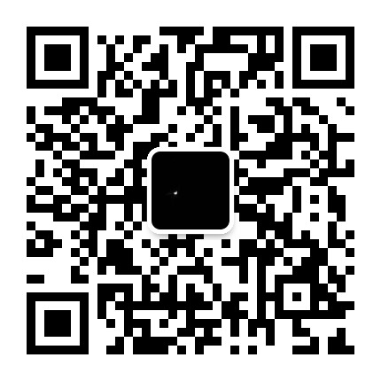

# AI2match
在实验室工作，将来可能会当老师，先行写一部教程出来，从0开始学习.  
基础进阶篇数学 python 机器学习 等  
实战竞赛篇 竞赛cvpr 天池 kaggle等，量化投资实战等。


先行商定一个目录，根据目录写完内容。  
会坚持更新,慢慢更新,比如说投资,需要验证时间比较长,不能我没有经过实战检验或者是实验结果不是很合理就把代码传上来装x了.  
这是毫无意义的,至少能坚持自己做有意义的事,自己都坚持不了,那就SM了.  

```
第一部分 基础篇   

第一章 数学基础  
第二章 python基础  

第二部分 进阶篇  

第三章  机器学习  
第四章  深度学习  
第五章  模型与库  

第三部分 竞赛篇  

第六章  平台介绍  
第七章  竞赛目标  
第八章  题目解析  

第四部分  实战篇  

第九章  量化投资  
第十章  装逼展示  
```
目录释义
```
basic/ 基础篇
 --math/
 --python/
advance/ 进阶篇
 --
 --
match/ 竞赛篇
 --
 --
subject/ 实战篇
 --
 --
```
<font color ="red"><b>已完成 正在努力完成中 链接版本目录</b></font>  

第一部分 基础进阶篇  
第1章 数学基础  
1.1 [数学基础](basic/math/数学基础.md)  
1.2 [统计学习方法](basic/math/统计学习方法.md)  
1.3 [概率论与数理统计(完结)](basic/math/概率论与数理统计.md)  

第2章 python基础  
2.1 [环境配置](basic/python/环境配置.md)  
2.2.0 [说明部分](basic/python/python基础.md)  
2.2.1 [python基本语法](basic/python/python-syntax.md)  
2.2.2  

第二部分 竞赛实战篇  
第3章 竞赛篇  
3.0  [非技术实时文--最近比赛报告](match/match-recent-report.md)  
3.1  [cv竞赛之去雨](match/cv-match1.md)  
3.2  [cv竞赛之商品识别]  
3.3  [cv竞赛之人群异常行为检测]  
3.4  [NLP竞赛之情感分析]  
3.5  [cv竞赛之flyai]  
3.6  [cv竞赛之遥感]  
3.7  [数据算法竞赛之算法设计]  

第4章  实战篇  
4.0 [非技术实时报告文--最近实战效果报告](subject/subject-recent-report.md)  
4.1 [一篇搞笑文章--"安全圈"与"娱乐圈"](subject/安全圈与娱乐圈.md)  
4.2 [量化投资之TensorFlow实操](subject/tf-invest/tf-investment.md)  
4.3 信息分析...  

-----

#### 联系我

<del>也希望能和知识图谱每天都更新，更新会在wx公众号，也会在github。</del>  
最近在疯狂打比赛,估计很多地方的更新都会放下.读题目,理解题目,建模,算法,优化,再优化,report,论文,每一个都是很花时间的:)   
这一年的比赛几乎都报了名了,CV类别的就有十多个,GANs这块的也有,NLP也有几个;强化学习的专业比赛感觉没找到,论文的话打算是在康纳尔大学论文库上投;    
CVPR ICML AAAI 已经凉了,还得继续加油ヾ(◍°∇°◍)ﾉﾞ  
学生们问我为什么不投学报 中心期刊,sorry,我对国内所有投稿均无兴趣.  

wx公众号:aokisec  

    

wx号:F182499  
<del>tel:15677405040</del>  
  

----

最近一直在写算法代码,很麻烦~~接下来会分析阿里新开源的MNN,确实还不错.

----
新买的ireader a6摔坏屏幕了,真开心.
```
tainanshou
```
