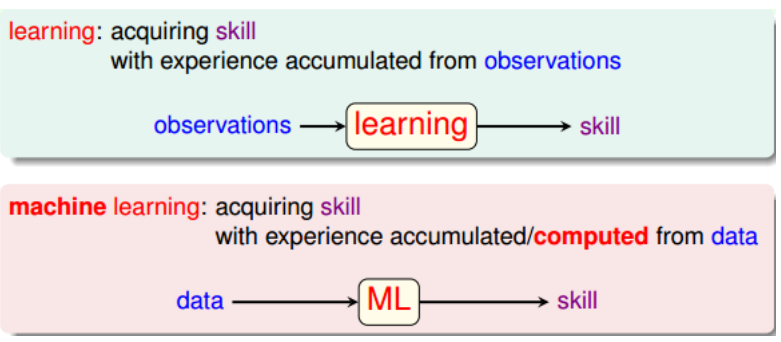
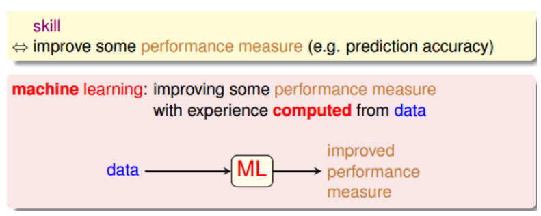
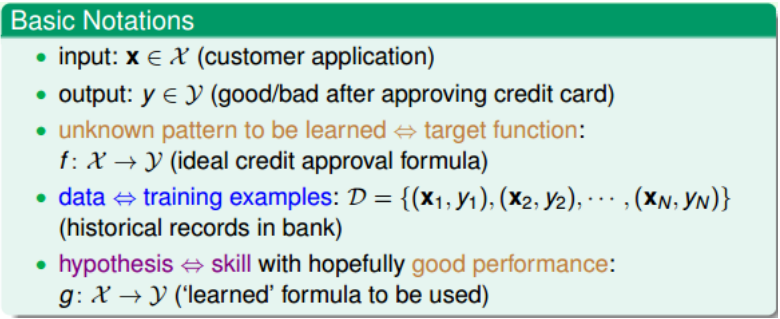
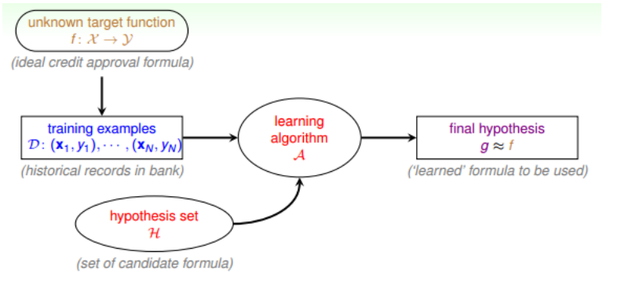

## 笔记1 ­­ The Learning
课程位置：https://www.bilibili.com/video/av85507974

四大部分：
When Can Machine Learn?
Why Can Machine Learn?
How Can Machine Learn?
How Can Machine Learn Better?

### 什么是机器学习  

什么是“学习”？学习就是人类通过观察、积累经验，掌握某项技能或能力。就好像我们从小学习识别字母、认识汉字，就是学习的过程。而机器学习（Machine Learning），顾名思义，就是让机器（计算机）也能向人类一样，通过观察大量的数据和训练，发现事物规律，获得某种分析问题、解决问题的能力。  

  
机器学习可以被定义：Improving some performance measure with experence computed from data. 也就是机器从数据中总结经验，从数据中找出某种规律或模型，并用它来解决实际问题。  

  

什么情况下会使用机器学习来解决问题呢？其实，目前机器学习的应用非常广泛，基本上任何场合都能够看到它的身影。其应用场合大致可归纳为三个条件：  

- 事物本身存在某种潜在规律
- 某些问题难以使用普通编程解决
- 有大量的数据样本可供使用

### 机器学习术语  
本系列的课程对机器学习问题有一些基本的术语需要注意一下：
- 输入x
- 输出y
- 目标函数f，即最接近实际样本分布的规律
- 训练样本data
- 假设hypothesis，一个机器学习模型对应了很多不同的hypothesis，通过演算法A，选择一个最佳的hypothesis对应的函数称为矩g，g能最好地表示事物的内在规律，也是我们最终想要得到的模型表达式  

英文表述  
  

### 机器学习流程图

  

流程图释义：  

对于理想的目标函数f，我们是不知道的，我们手上拿到的是一些训练样本D，假设是监督式学习，其中有输入x，也有输出y。机器学习的过程，就是根据先验知识选择模型，该模型对应的hypothesis set（用H表示），H中包含了许多不同的hypothesis，通过演算法A，在训练样本D上进行训练，选择出一个最好的hypothes，对应的函数表达式g就是我们最终要求的。一般情况下，g能最接近目标函数f，这样，机器学习的整个流程就完成了。

### 机器学习相关领域  
与机器学习相关的领域有：  
- 数据挖掘（Data Mining）
- 人工智能（Artificial Intelligence）
- 统计（Statistics）
