## 笔记10 ­­ Logistic Regression  
课程位置：https://www.bilibili.com/video/av85507974  

>上一节课，我们介绍了Linear Regression线性回归，以及用平方错误来寻找最佳的权重向量w，获得最好的线性预测。本节课将介绍Logistic Regression逻辑回归问题。  

## Logistic Regression Problem

一个心脏病预测的问题：根据患者的年龄、血压、体重等信息，来预测患者是否会有心脏病。很明显这是一个二分类问题，其输出y只有{­1,1}两种情况。  

二元分类，一般情况下，理想的目标函数f(x)>0.5，则判断为正类1；若f(x)<0.5，则判断为负类­1。  

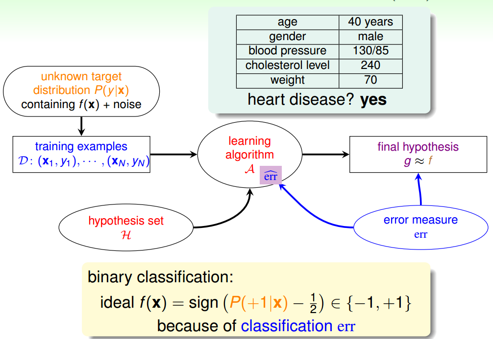  

但是，如果我们想知道的不是患者有没有心脏病，而是到底患者有多大的几率是心脏病。这表示，我们更关心的是目标函数的值（分布在0,1之间），表示是正类的概率（正类表示是心脏病）。这跟我们原来讨论的二分类问题不太一样，我们把这个问题称为软性二分类问题（'soft' binary classification）。这个值越接近1，表示正类的可能性越大；越接近0，表示负类的可能性越大。  

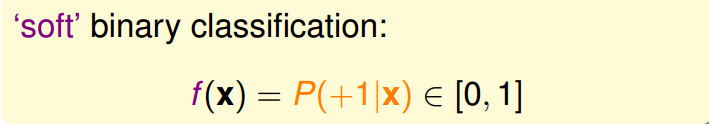  

对于软性二分类问题，理想的数据是分布在[0,1]之间的具体值，但是实际中的数据只可能是0或者1，我们可以把实际中的数据看成是理想数据加上了噪声的影响。  

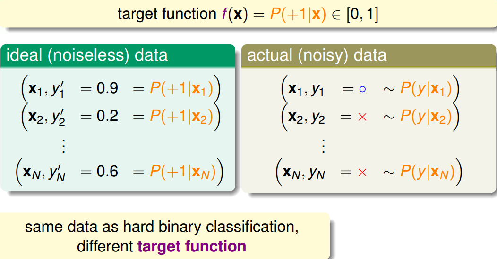  

如果目标函数是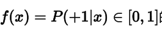 的话，我们如何找到一个好的Hypothesis跟这个目标函数很接近呢？  

首先，根据我们之前的做法，对所有的特征值进行加权处理。计算的结果s，我们称之为'risk score'：  

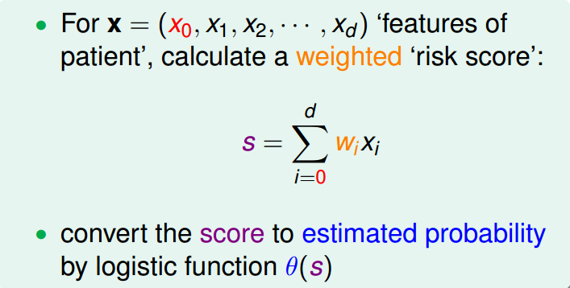  

但是特征加权和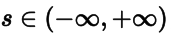 ，如何将s值限定在[0,1]之间呢？一个方法是使用sigmoid Function，记为 。那么我们的目标就是找到一个hypothesis：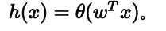  

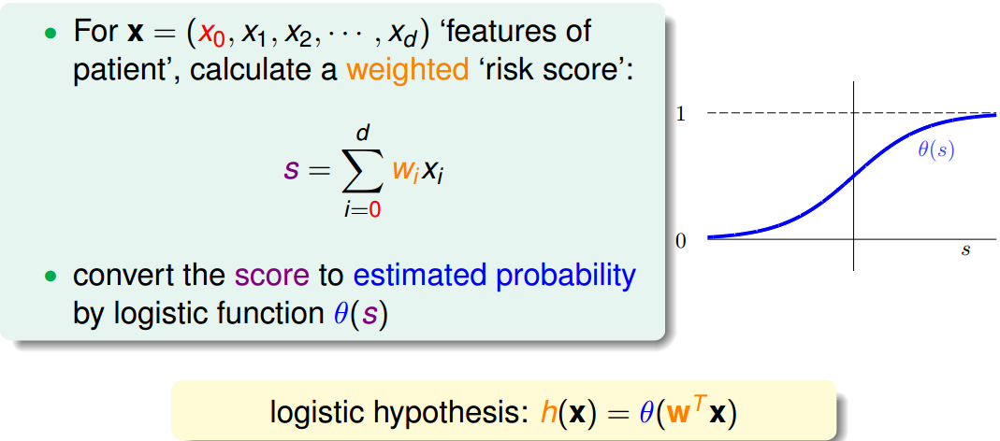  

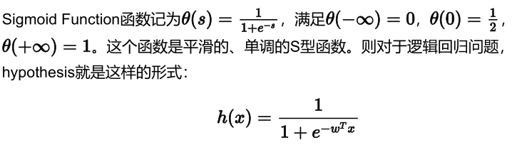  

那我们的目标就是求出这个预测函数h(x)，使它接近目标函数f(x)。  

## Logistic Regression Error

现在我们将Logistic Regression与之前讲的Linear Classification、Linear Regression做个比较：  

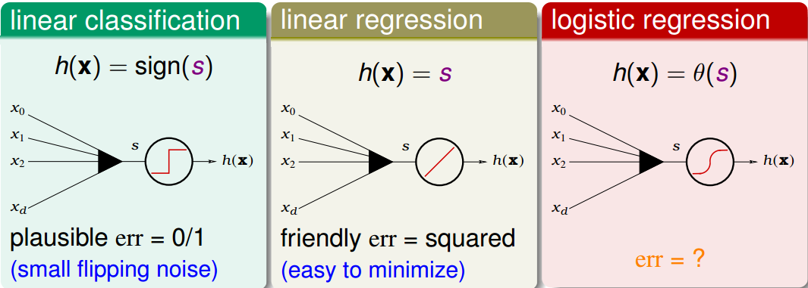  

这三个线性模型都会用到线性scoring function 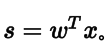 。linear classification的误差使用的是0/1 err；linear regression的误差使用的是squared err。那么logistic regression的误差该如何定义呢？  

先介绍一下“似然性”的概念。目标函数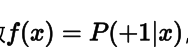 ，如果我们找到了hypothesis很接近target function。也就是说，在所有的Hypothesis集合中找到一个hypothesis与target function最接近，能产生同样的数据集D，包含y输出label，则称这个hypothesis是最大似然likelihood。  

  

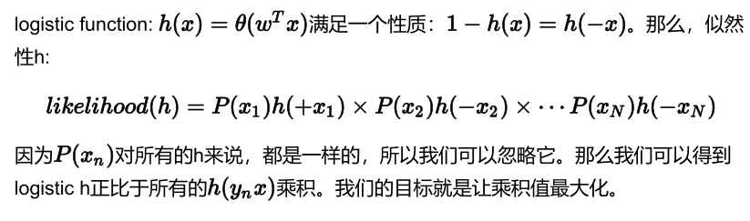  

如果将w代入的话：  

为了把连乘问题简化计算，我们可以引入ln操作，让连乘转化为连加：  

接着，我们将maximize问题转化为minimize问题，添加一个负号就行，并引入平均数
操作 1/N：  

将logistic function的表达式带入，那么minimize问题就会转化为如下形式：  
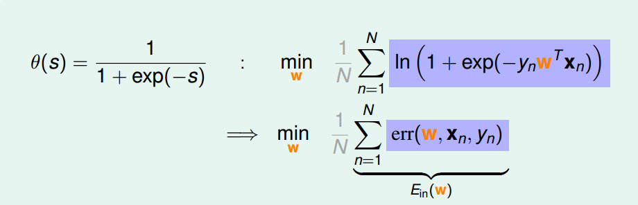  
至此，我们得到了logistic regression的err function，称之为cross­entropy error交叉熵误差：  

## Gradient of Logistic Regression Error

我们已经推导了 Ein 的表达式，那接下来的问题就是如何找到合适的向量w，让 Ein  最小。  

Logistic Regression的 Ein是连续、可微、二次可微的凸曲线（开口向上），根据之前Linear Regression的思路，我们只要计算 Ein 的梯度为零时的w，即为最优解。
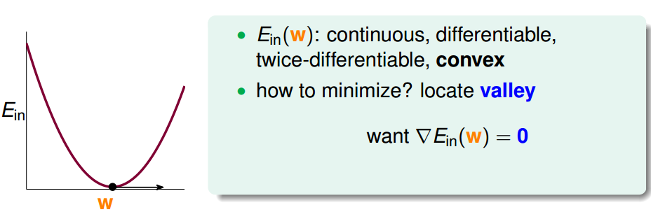
对 Ein 计算梯度，学过微积分的都应该很容易计算出来：
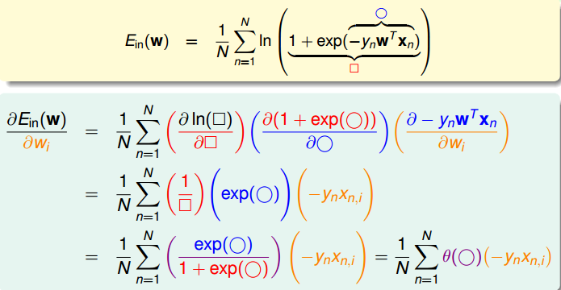
最终得到的梯度表达式为：
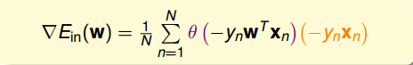
为了计算 Ein 最小值，我们就要找到让 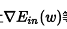等于0的位置。  

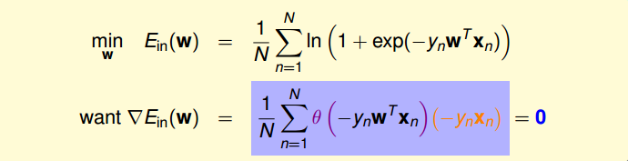

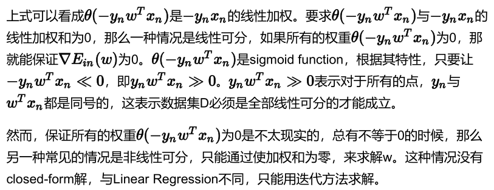

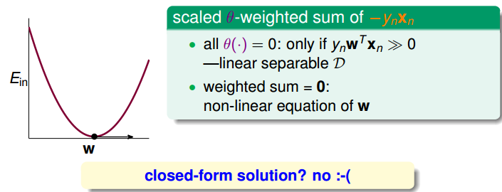

之前所说的Linear Regression有closed­form解，可以说是“一步登天”的；但是PLA算法是一步一步修正迭代进行的，每次对错误点进行修正，不断更新w值。PLA的迭代优化过程表示如下：  
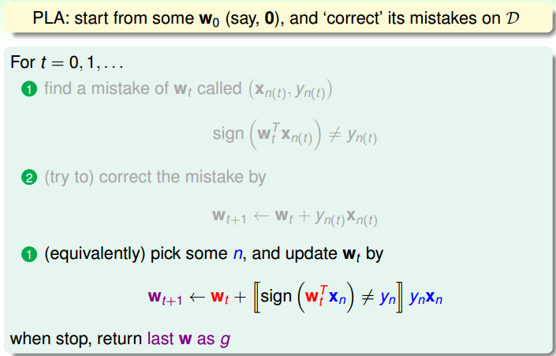  

w每次更新包含两个内容：一个是每次更新的方向 ，用 表示，另一个是每次更
新的步长 。参数 和终止条件决定了我们的迭代优化算法。  

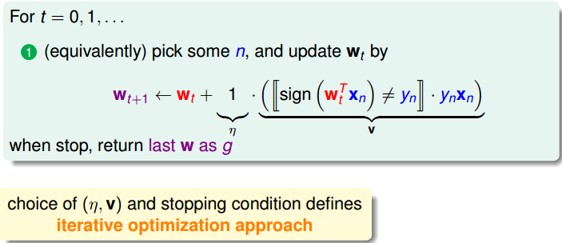

## Gradient Descent

根据上一小节PLA的思想，迭代优化让每次w都有更新：
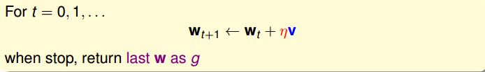  
我们把 曲线看做是一个山谷的话，要求 Ein（w）最小，即可比作下山的过程。
整个下山过程由两个因素影响：一个是下山的单位方向v ；另外一个是下山的步长 。
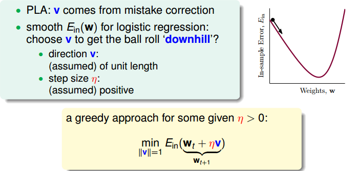  

利用微分思想和线性近似，假设每次下山我们只前进一小步，即 很小，那么根据泰勒Taylor一阶展开，可以得到：  

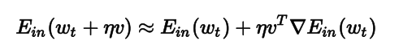  

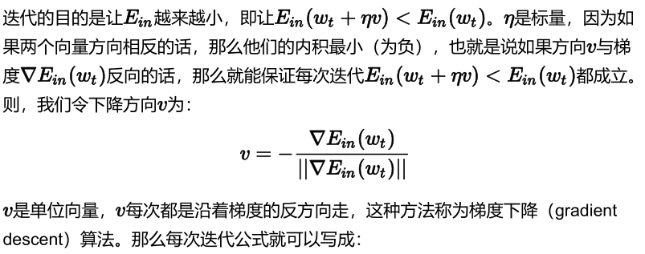  

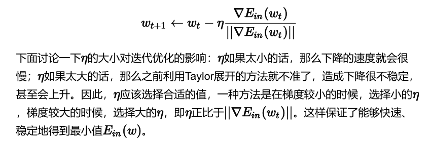  

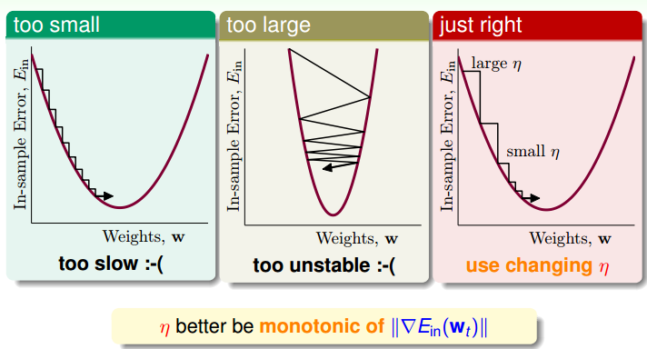  

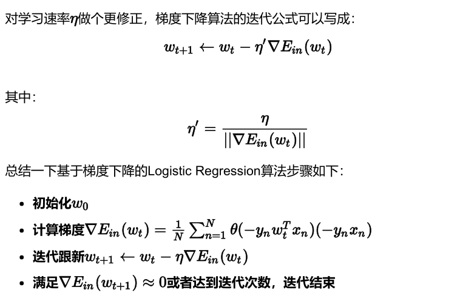  

## 总结

我们今天介绍了Logistic Regression。首先，从逻辑回归的问题出发，将 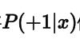作为目标函数，将 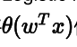作为hypothesis。接着，我们定义了logistic regression的errfunction，称之为cross­entropy error交叉熵误差。然后，我们计算logistic regressionerror的梯度，最后，通过梯度下降算法，计算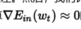 时对应的 值。
