## 笔记12 ­­ Nonlinear Transformation  
课程位置：https://www.bilibili.com/video/av85507974

>上一节课，我们介绍了分类问题的三种线性模型，可以用来解决binary classification和multiclass classification问题。本节课主要介绍非线性的模型来解决分类问题。   

## Quadratic Hypothesis

之前介绍的线性模型，在2D平面上是一条直线，在3D空间中是一个平面。数学上，我们用线性得分函数s来表示：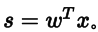 。其中，x为特征值向量，w为权重，s是线性的。  

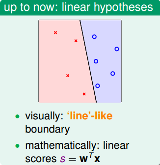  

线性模型的优点就是，它的VC Dimension比较小，保证了Ein ≈ Eout 。但是缺点也很明显，对某些非线性问题，可能会造成 Ein 很大，虽然 Ein ≈ Eout，但是也造成 Eout很大，分类效果不佳。  

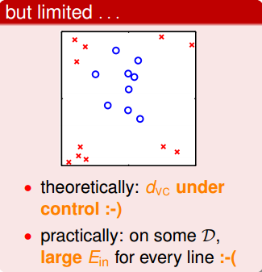  

为了解决线性模型的缺点，我们可以使用非线性模型来进行分类。例如数据集D不是线性可分的，而是圆形可分的，圆形内部是正类，外面是负类。假设它的hypotheses可以写成：  

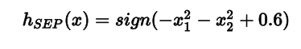  

基于这种非线性思想，我们之前讨论的PLA、Regression问题都可以有非线性的形式进行求解。  

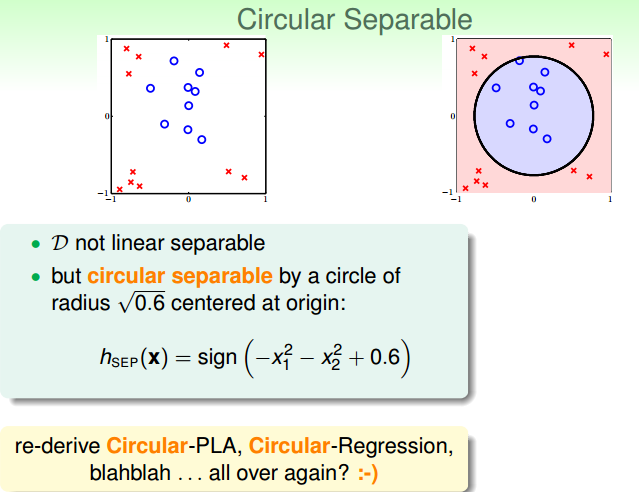  

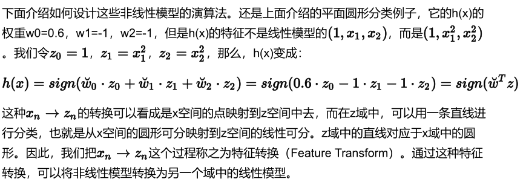  

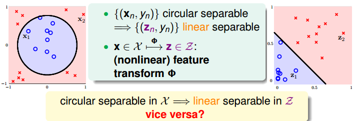

已知x域中圆形可分在z域中是线性可分的，那么反过来，如果在z域中线性可分，是否在x域中一定是圆形可分的呢？答案是否定的。由于权重向量w取值不同，x域中的hypothesis可能是圆形、椭圆、双曲线等等多种情况。  
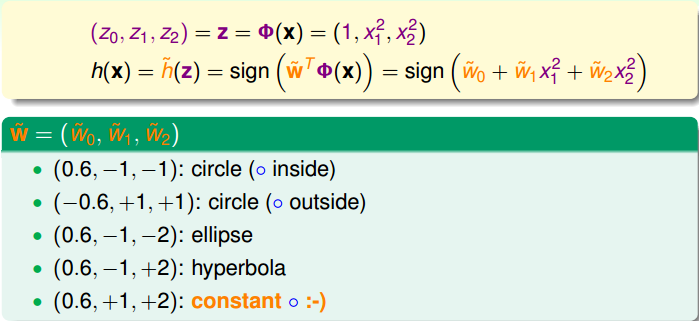  

目前讨论的x域中的圆形都是圆心过原点的，对于圆心不过原点的一般情况， 映射公式包含的所有项为：  

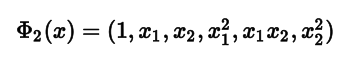  

也就是说，对于二次hypothesis，它包含二次项、一次项和常数项1，z域中每一条线对应x域中的某二次曲线的分类方式，也许是圆，也许是椭圆，也许是双曲线等等。那么z域中的hypothesis可以写成：  

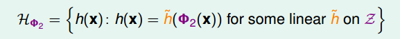  

## Nonlinear Transform

上一部分我们定义了什么了二次hypothesis，那么这部分将介绍如何设计一个好的二次hypothesis来达到良好的分类效果。那么目标就是在z域中设计一个最佳的分类线。  

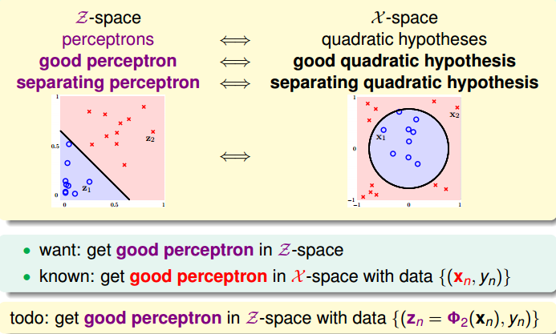  

其实，做法很简单，利用映射变换的思想，通过映射关系，把x域中的最高阶二次的多项式转换为z域中的一次向量，也就是从quardratic hypothesis转换成了perceptrons问题。用z值代替x多项式，其中向量z的个数与x域中x多项式的个数一致（包含常数项）。这样就可以在z域中利用线性分类模型进行分类训练。训练好的线性模型之后，再将z替换为x的多项式就可以了。具体过程如下：  

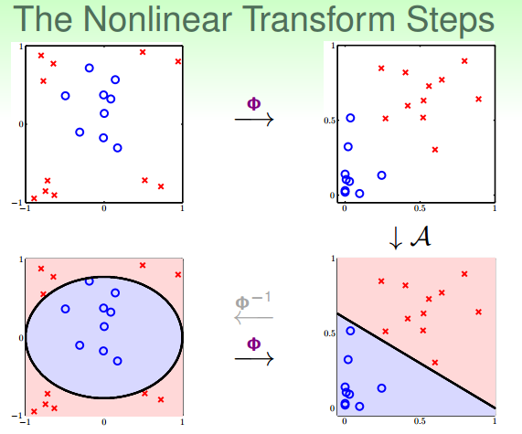  

整个过程就是通过映射关系，换个空间去做线性分类，重点包括两个：  
- 特征转换
- 训练线性模型

其实，我们以前处理机器学习问题的时候，已经做过类似的特征变换了。比如数字识别问题，我们从原始的像素值特征转换为一些实际的concrete特征，比如密度、对称性等等，这也用到了feature transform的思想。  

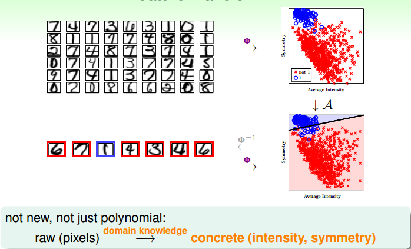  

## Price of Nonlinear Transform

若x特征维度是d维的，也就是包含d个特征，那么二次多项式个数，即z域特征维度是： 

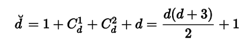  

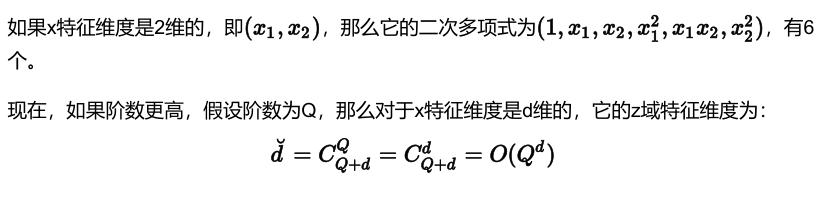  

由上式可以看出，计算z域特征维度个数的时间复杂度是Q的d次方，随着Q和d的增大，计算量会变得很大。同时，空间复杂度也大。也就是说，这种特征变换的一个代价是计算的时间、空间复杂度都比较大。  

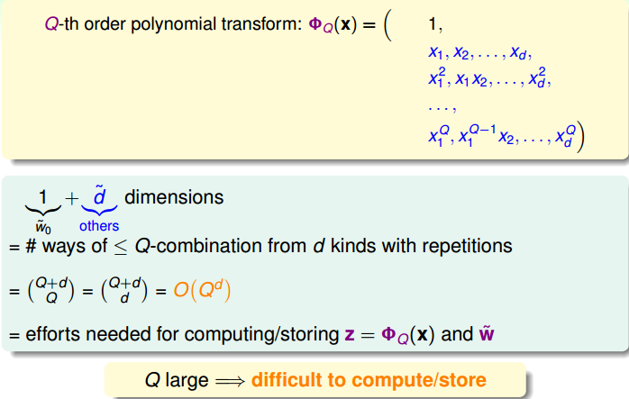

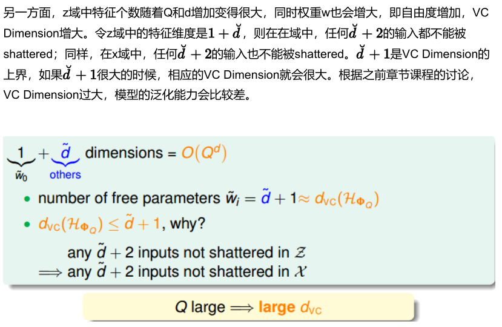  

下面通过一个例子来解释为什么VC Dimension过大，会造成不好的分类效果：  

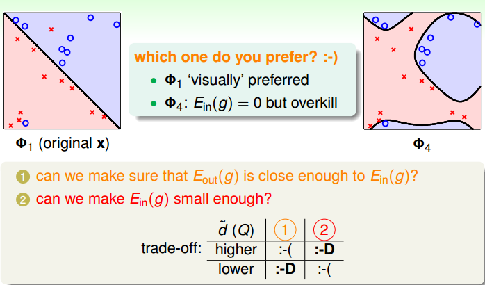  

上图中，左边是用直线进行线性分类，有部分点分类错误；右边是用四次曲线进行非线性分类，所有点都分类正确，那么哪一个分类效果好呢？单从平面上这些训练数据来看，四次曲线的分类效果更好，但是四次曲线模型很容易带来过拟合的问题，虽然它的 比较小，从泛化能力上来说，还是左边的分类器更好一些。也就是说VC Dimension过大会带来过拟合问题，不能太大了。  

那么如何选择合适的Q，来保证不会出现过拟合问题，使模型的泛化能力强呢？一般情况下，为了尽量减少特征自由度，我们会根据训练样本的分布情况，人为地减少、省略一些项。但是，这种人为地删减特征会带来一些“自我分析”代价，虽然对训练样本分类效果好，但是对训练样本外的样本，不一定效果好。所以，一般情况下，还是要保存所有的多项式特征，避免对训练样本的人为选择。  

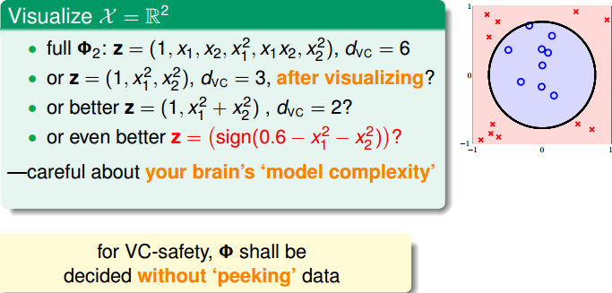  

## Structured Hypothesis Sets

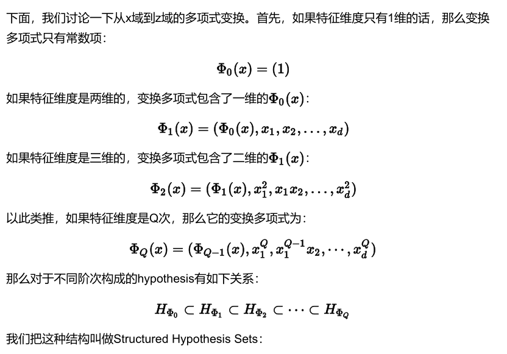  

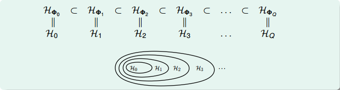  

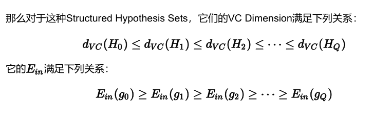  

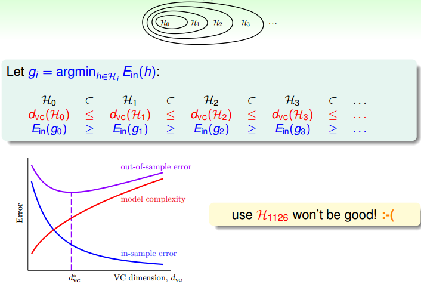

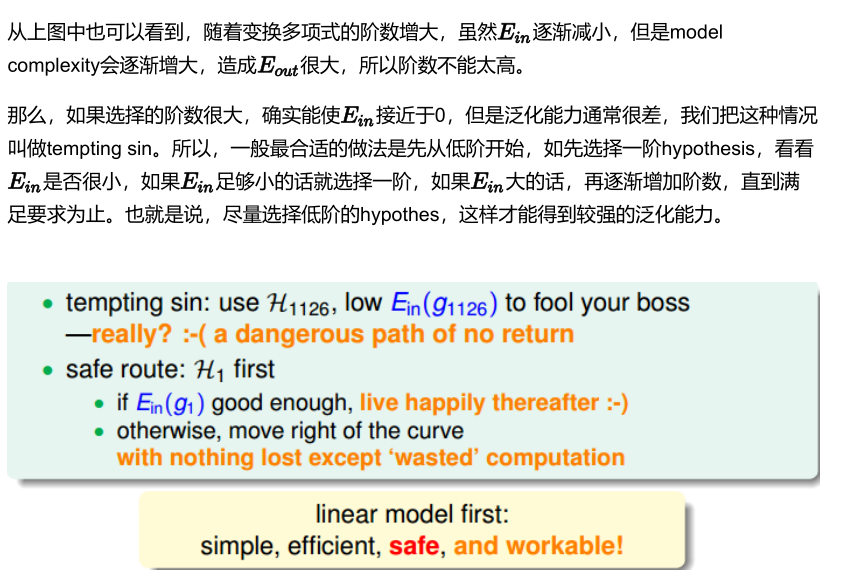  

## 总结

这节课主要介绍了非线性分类模型，通过非线性变换，将非线性模型映射到另一个空间，转换为线性模型，再来进行线性分类。本节课完整介绍了非线性变换的整体流程，以及非线性变换可能会带来的一些问题：时间复杂度和空间复杂度的增加。最后介绍了在要付出代价的情况下，使用非线性变换的最安全的做法，尽可能使用简单的模型，而不是模型越复杂越好。  
