## 笔记2 ­­ Learning to Answer Yes­No
课程位置：https://www.bilibili.com/video/av85507974

> 介绍感知机Perceptron模型，并推导课程的第一个机器学习算法：Perceptron Learning Algorithm（PLA）

## Perceptron Hypothesis Set

引入这样一个例子：某银行要根据用户的年龄、性别、年收入等情况来判断是否给该用户发信用卡。现在有训练样本D，即之前用户的信息和是否发了信用卡。这是一个典型的机器学习问题，我们要根据D，通过A，在H中选择最好的h，得到g，接近目标函数f，也就是根据先验知识建立是否给用户发信用卡的模型。银行用这个模型对以后用户进行判断：发信用卡（+1），不发信用卡（­1）。  

在这个机器学习的整个流程中，有一个部分非常重要：就是模型选择，即Hypothesis Set。选择什么样的模型，很大程度上会影响机器学习的效果和表现。下面介绍一个简单常用的Hypothesis Set：感知机（Perceptron）。还是刚才银行是否给用户发信用卡的例子，我们把用户的个人信息作为特征向量x，令总共有d个特征，每个特征赋予不同的权重w，表示该特征对输出（是否发信用卡）的影响有多大。那所有特征的加权和的值与一个设定的阈值threshold进行比较：大于这个阈值，输出为+1，即发信用卡；小于这个阈值，输出为­1，即不发信用卡。感知机模型，就是当特征加权和与阈值的差大于或等于0，则输出h(x)=1；当特征加权和与阈值的差小于0，则输出h(x)=­1，而我们的目的就是计算出所有权值w和阈值threshold。  

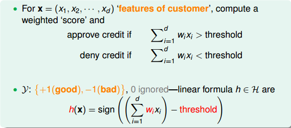  

为了计算方便，通常我们将阈值threshold当做 ，引入一个 的量与 相乘，这样就把threshold也转变成了权值 ，简化了计算。h(x)的表达式做如下变换：  

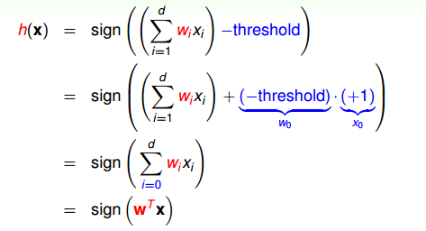  

为了更清晰地说明感知机模型，我们假设Perceptrons在二维平面上，即`h(x)=sign(w0 + w1x1 + w1x1)`。其中`w0 + w1x1 + w1x1 = 0` ， 是平面上一条分类直线，直线一侧是正类（+1），直线另一侧是负类（­1）。权重w不同，对应于平面上不同的直线。  
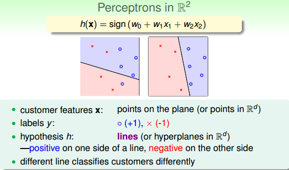  

那么，我们所说的Perceptron，在这个模型上就是一条直线，称为linear(binary) classifiers。注意一下，感知器线性分类不限定在二维空间中，在3D中，线性分类用平面表示，在更高维度中，线性分类用超平面表示，即只要是形如 的线性模型就都属于linear(binary) classifiers。同时，需要注意的是，这里所说的linear(binary) classifiers是用简单的感知器模型建立的，线性分类问题还可以使用logistic regression来解决，后面将会介绍。  

## Perceptron Learning Algorithm(PLA)  

根据上一部分的介绍，我们已经知道了hypothesis set由许多条直线构成。接下来，我们的目的就是如何设计一个演算法A，来选择一个最好的直线，能将平面上所有的正类和负类完全分开，也就是找到最好的g，使 `g≈f`。  

如何找到这样一条最好的直线呢？我们可以使用逐点修正的思想，首先在平面上随意取一条直线，看看哪些点分类错误。然后开始对第一个错误点就行修正，即变换直线的位置，使这个错误点变成分类正确的点。接着，再对第二个、第三个等所有的错误分类点就行直线纠正，直到所有的点都完全分类正确了，就得到了最好的直线。这种“逐步修正”，就是PLA思想所在。  

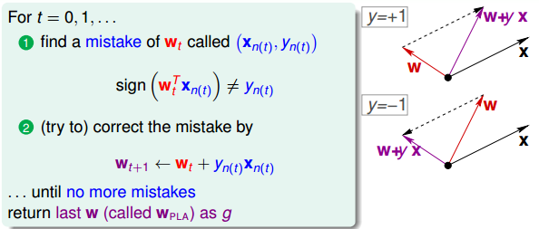  

下面介绍一下PLA是怎么做的。首先随机选择一条直线进行分类。然后找到第一个分类错误的点，如果这个点表示正类，被误分为负类，即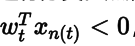 ，那表示w和x夹角大于90度，其中w是直线的法向量。所以，x被误分在直线的下侧（相对于法向量，法向量的方向即为正类所在的一侧），修正的方法就是使w和x夹角小于90度。通常做法是`w←w+yx,y=1` ，如图右上角所示，一次或多次更新后的 与x夹角小于90度，能保证x位于直线的上侧，则对误分为负类的错误点完成了直线修正。  

同理，如果是误分为正类的点，即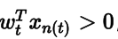，那表示w和x夹角小于90度，其中w是直线的法向量。所以，x被误分在直线的上侧，修正的方法就是使w和x夹角大于90度。通常做法是`w←w+yx,y=-1` ，如图右下角所示，一次或多次更新后的`w+yx`与x夹角大于90度，能保证x位于直线的下侧，则对误分为正类的错误点也完成了直线修正。  

按照这种思想，遇到个错误点就进行修正，不断迭代。要注意一点：每次修正直线，可能使之前分类正确的点变成错误点，这是可能发生的。但是没关系，不断迭代，不断修正，最终会将所有点完全正确分类（PLA前提是线性可分的）。这种做法的思想是“知错能改”，有句话形容它：“A fault confessed is half redressed.”  

实际操作中，可以一个点一个点地遍历，发现分类错误的点就进行修正，直到所有点全部分类正确。这种被称为Cyclic PLA  

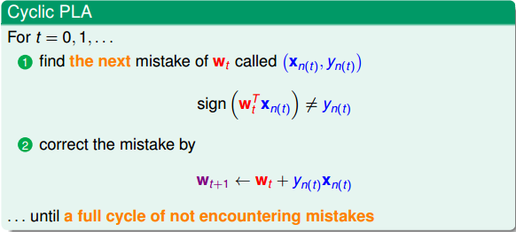   
图解PLA的修正过程：  
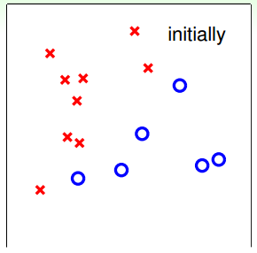  
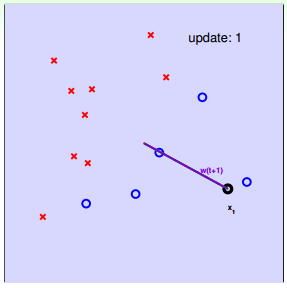  
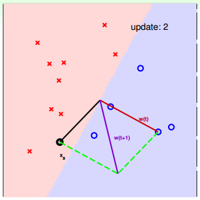  
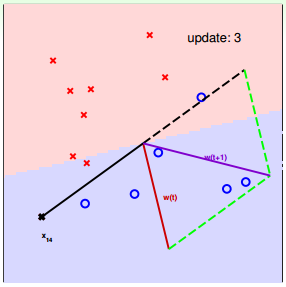  
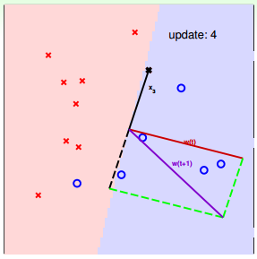  
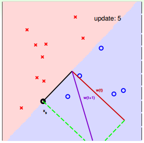  
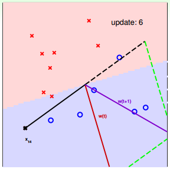  
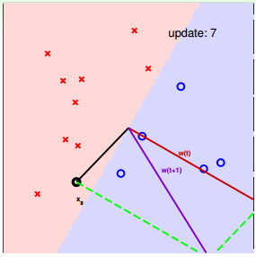  
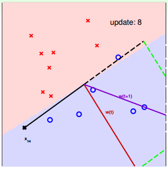  
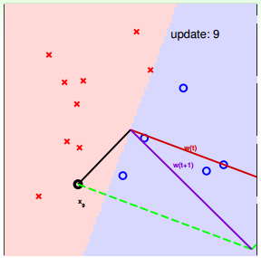  
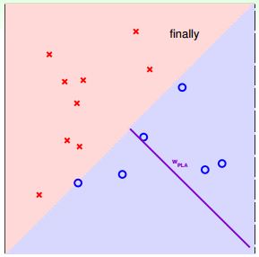  

#### 对PLA，我们需要考虑以下两个问题：  
- PLA迭代一定会停下来吗？如果线性不可分怎么办？
- PLA停下来的时候，是否能保证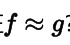 ？如果没有停下来，是否有 ？  

## Guarantee of PLA

PLA什么时候会停下来呢？根据PLA的定义，当找到一条直线，能将所有平面上的点都分类正确，那么PLA就停止了。要达到这个终止条件，就必须保证D是线性可分（linear separable）。如果是非线性可分的，那么，PLA就不会停止。  

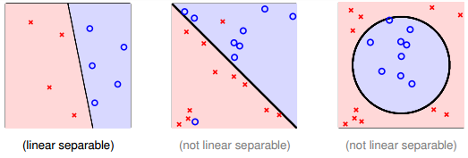  
对于线性可分的情况，如果有这样一条直线，能够将正类和负类完全分开，令这时候
的目标权重为 ，则对每个点，必然满足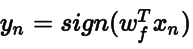 ，即对任一点：  

  
PLA会对每次错误的点进行修正，更新权重 的值，如果 与 越来越接近，
数学运算上就是内积越大，那表示 是在接近目标权重 ，证明PLA是有学习效
果的。所以，我们来计算 与 的内积：（不支持部分数学公式。。）  

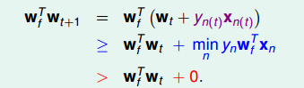  

从推导可以看出， 与 的内积跟 与 的内积相比更大了。似乎说明了
更接近 ，但是内积更大，可能是向量长度更大了，不一定是向量间角度更小。所
以，下一步，我们还需要证明 与 向量长度的关系：

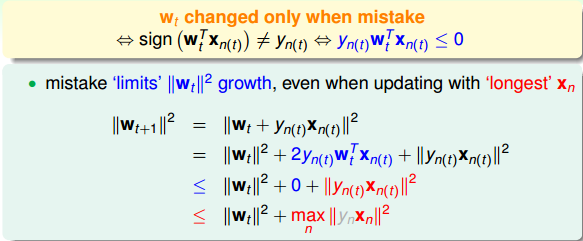  
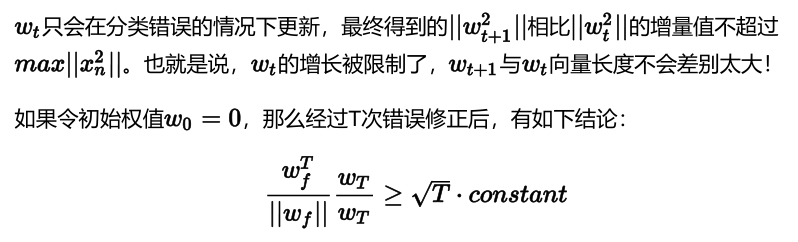  

#### 具体推导过程

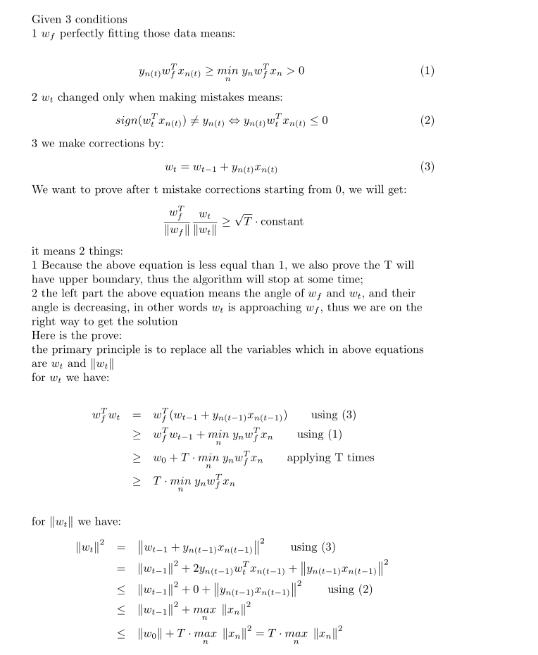  
1next
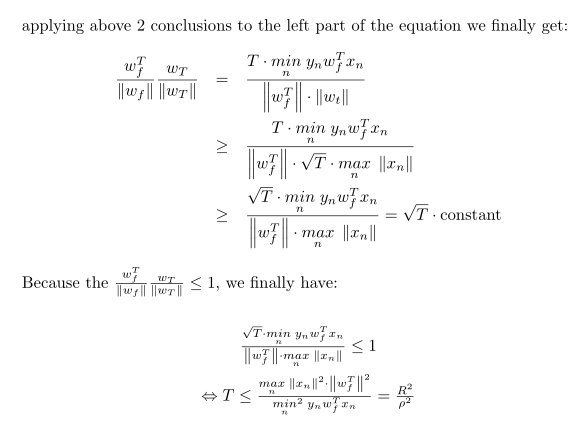  

上述不等式左边其实是wT 与 Wf夹角的余弦值，随着T增大，该余弦值越来越接近1，即 与 越来越接近。同时，需要注意的是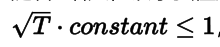， ，也就是说，迭代次数T是有上界的。根据以上证明，我们最终得到的结论是： 与 的是随着迭代次数增加，逐渐接近的。而且，PLA最终会停下来（因为T有上界），实现对线性可分的数据集完全分类。

## Non­Separable Data

上一部分，我们证明了线性可分的情况下，PLA是可以停下来并正确分类的，但对于非线性可分的情况， 实际上并不存在，那么之前的推导并不成立，PLA不一定会停下来。所以，PLA虽然实现简单，但也有缺点：

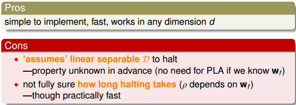  

#### 对于非线性可分的情况，我们可以把它当成是数据集D中掺杂了一下noise，事实上，大多数情况下我们遇到的D，都或多或少地掺杂了noise。这时，机器学习流程是这样的：

  
在非线性情况下，我们可以把条件放松，即不苛求每个点都分类正确，而是容忍有错误点，取错误点的个数最少时的权重w：

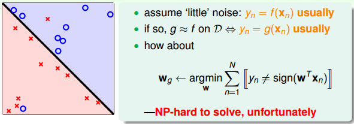  

事实证明，上面的解是NP­hard问题，难以求解。然而，我们可以对在线性可分类型中表现很好的PLA做个修改，把它应用到非线性可分类型中，获得近似最好的g。

修改后的PLA称为Packet Algorithm。它的算法流程与PLA基本类似，首先初始化权重，计算出在这条初始化的直线中，分类错误点的个数。然后对错误点进行修正，更新w，得到一条新的直线，在计算其对应的分类错误的点的个数，并与之前错误点个数比较，取个数较小的直线作为我们当前选择的分类直线。之后，再经过n次迭代，不断比较当前分类错误点个数与之前最少的错误点个数比较，选择最小的值保存。直到迭代次数完成后，选取个数最少的直线对应的w，即为我们最终想要得到的权重值。

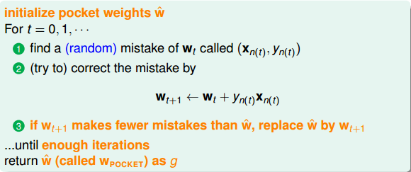  

如何判断数据集D是不是线性可分？对于二维数据来说，通常还是通过肉眼观察来判断的。一般情况下，Pocket Algorithm要比PLA速度慢一些。

## 总结  

本节课主要介绍了线性感知机模型，以及解决这类感知机分类问题的简单算法：PLA。我们详细证明了对于线性可分问题，PLA可以停下来并实现完全正确分类。对于不是线性可分的问题，可以使用PLA的修正算法Pocket Algorithm来解决。 
