## 笔记6 ­­ Theory of Generalization
课程位置：https://www.bilibili.com/video/av85507974  

>上一节课，我们主要探讨了当M的数值大小对机器学习的影响。如果M很大，那么就不能保证机器学习有很好的泛化能力，所以问题转换为验证M有限，即最好是按照多项式成长。然后通过引入了成长函数mh(N) 和dichotomy以及break point的概念，提出2D perceptrons的成长函数mh(N) 是多项式级别的猜想。这就是本节课将要深入探讨和证明的内容。  

## Restriction of Break Point

四种成长函数与break point的关系

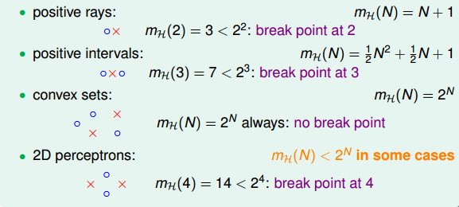  

下面引入一个例子，如果k=2，那么当N取不同值的时候，计算其成长函数mh(N) 是多少。很明显，当N=1时， mh(N)=2,；当N=2时，由break point为2可知，任意两点都不能被shattered（shatter的意思是对N个点，能够分解为2的N次方 种dichotomies）；mh(N)最大值只能是3；当N=3时，简单绘图分析可得其mh(N)=4 ，即最多只有4种dichotomies。  

  

所以，我们发现当N>k时，break point限制了 mh(N)值的大小，也就是说影响成长函数 mh(N)的因素主要有两个：  

- 抽样数据集N
- break point k（这个变量确定了假设的类型）

那么，如果给定N和k，能够证明其 mh(N)的最大值的上界是多项式的，则根据霍夫丁不等式，就能用mh(N) 代替M，得到机器学习是可行的。所以，证明 mh(N)的上界是poly(N)，是我们的目标。  

  

## Bounding Function: Basic Cases

现在，我们引入一个新的函数：bounding function，B(N,k)。Bound Function指的是当break point为k的时候，成长函数mh(N) 可能的最大值。也就是说B(N,k)是mh(N)的上界，对应mh(N) 最多有多少种dichotomy。那么，我们新的目标就是证明：  

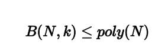  

这里值得一提的是，B(N,k)的引入不考虑是1D postive intrervals问题还是2D perceptrons问题，而只关心成长函数的上界是多少，从而简化了问题的复杂度   

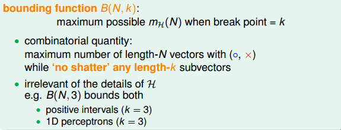  

求解B(N,k)的过程十分巧妙：  
- 当k=1时，B(N,1)恒为1。
- 当N < k时，根据break point的定义，很容易得到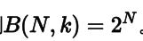 。
- 当N = k时，此时N是第一次出现不能被shatter的值，所以最多只能有 个dichotomies，则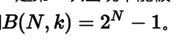 。  

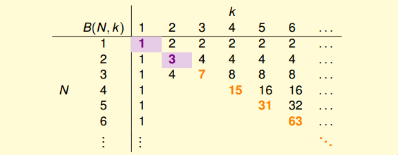  

到此，bounding function的表格已经填了一半了，对于最常见的N>k的情况比较复杂，推导过程下一小节再详细介绍。  

## Bounding Function: Inductive Cases

N > k的情况较为复杂，下面给出推导过程：  
以B(4,3)为例，首先想着能否构建B(4,3)与B(3,x)之间的关系。  

首先，把B(4,3)所有情况写下来，共有11组。也就是说再加一种dichotomy，任意三点都能被shattered，11是极限。  

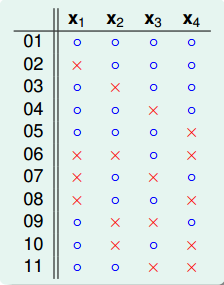  

对这11种dichotomy分组，目前分成两组，分别是orange和purple，orange的特点是，x1,x2和x3是一致的，x4不同并成对，例如1和5，2和8等，purple则是单一的，x1,x2,x3都不同，如6,7,9三组。  

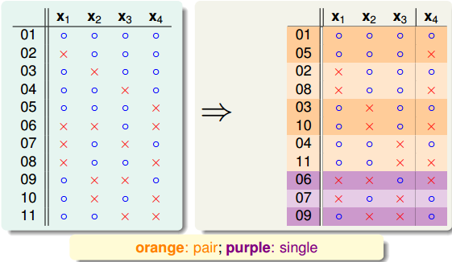  

将Orange去掉x4后去重得到4个不同的vector并成为 ，相应的purple为 。那么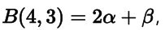
，这个是直接转化。紧接着，由定义，B(4,3)是不能允许任意三点
shatter的，所以由 和 构成的所有三点组合也不能shatter（alpha经过去重），即
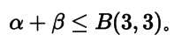  

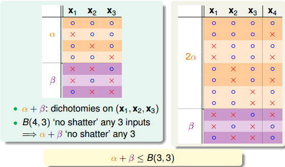  

另一方面，由于α 中x4是成对存在的，且α 是不能被任意三点shatter的，则能推导出α是不能被任意两点shatter的。这是因为，如果 α是不能被任意两点shatter，而x4又是成对存在的，那么x1、x2、x3、x4组成的α 必然能被三个点shatter。这就违背了条件的设定。这个地方的推导非常巧妙，也解释了为什么会这样分组。此处得到的结论是α ≤ B（3，2）。  

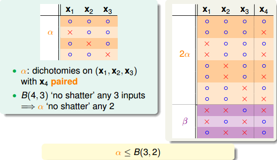  

由此得出B(4,3)与B(3,x)的关系为：  

  

最后，推导出一般公式为

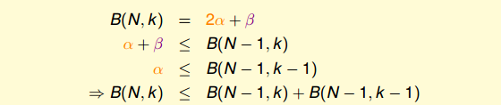  

根据推导公式，下表给出B(N,K)值   

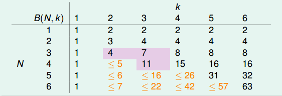  

根据递推公式，推导出B(N,K)满足下列不等式：  

  

上述不等式的右边是最高阶为k­1的N多项式，也就是说成长函数mh(N) 的上界B(N,K)的上界满足多项式分布poly(N)，这就是我们想要得到的结果。得到了 的上界B(N,K)的上界满足多项式分布poly(N)后，我们回过头来看看之前介绍的几种类型它们的mh(N)  与break point的关系：  

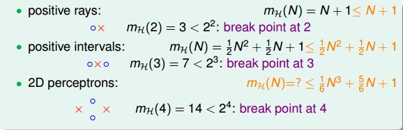  

我们得到的结论是，对于2D perceptrons，break point为k=4， mh(N)的上界是N的k-1次方。推广一下，也就是说，如果能找到一个模型的break point，且是有限大的，那么就能推断出其成长函数mh(N) 有界。  

## A Pictorial Proof

我们已经知道了成长函数的上界是poly(N)的，下一步，如果能将 mh(N)代替M，代
入到Hoffding不等式中，就能得到Eout ≈ Ein 的结论：  

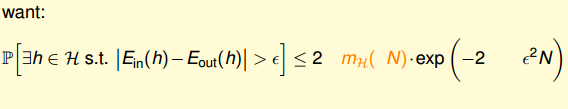  

实际上并不是简单的替换就可以了，正确的表达式为：  

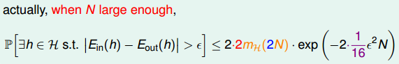  

该推导的证明比较复杂，我们可以简单概括为三个步骤来证明：  

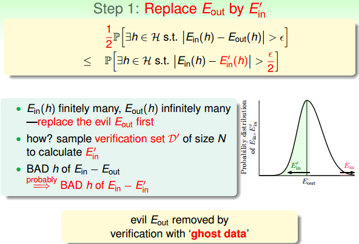  

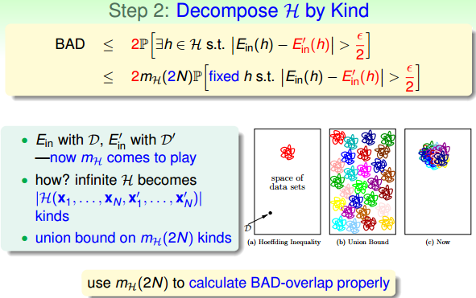  

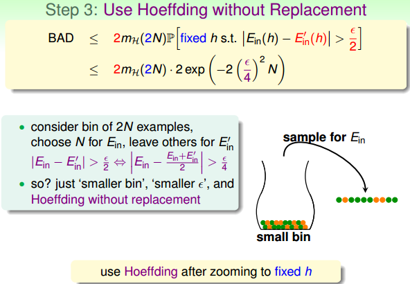  

这部分内容，我也只能听个大概内容，对具体的证明过程有兴趣的童鞋可以自行研究一下，研究的结果记得告诉一下我哦。  

最终，我们通过引入成长函数mh ，得到了一个新的不等式，称为Vapnik­ Chervonenkis(VC) bound：  

  

对于2D perceptrons，它的break point是4，那么成长函数mh(N) = O(N的3次方) 。所以，我们可以说2D perceptrons是可以进行机器学习的，只要找到hypothesis能让Ein ≈ 0，就能保证Ein ≈ Eout 。  

## 总结

本节课我们主要介绍了只要存在break point，那么其成长函数 mh(N)就满足poly(N)。推导过程是先引入 mh(N)的上界B(N,k)，B(N,k)的上界是N的k­-1阶多项式，从而得到mh(N) 的上界就是N的k­1阶多项式。然后，我们通过简单的三步证明，将mh(N) 代入了Hoffding不等式中，推导出了Vapnik­Chervonenkis(VC) bound，最终证明了只要break point存在，那么机器学习就是可行的。  
