## 笔记6 ­­ The VC Dimension
课程位置：https://www.bilibili.com/video/av85507974  

前几节课着重介绍了机器能够学习的条件并做了详细的推导和解释。机器能够学习必
须满足两个条件：  
- 假设空间H的Size M是有限的，即当N足够大的时候，那么对于假设空间中任意一个假设g，Eout ≈ Ein 。  
- 利用算法A从假设空间H中，挑选一个g，使 Ein（g） = 0 ，则 Eout ≈ 0。  

这两个条件，正好对应着test和trian两个过程。train的目的是使损失期望Ein（g） = 0；test的目的是使将算法用到新的样本时的损失期望也尽可能小，即Eout = 0 。  
正因为如此，上次课引入了break point，并推导出只要break point存在，则M有上界，一定存在Eout ≈ Ein 。  
本次笔记主要介绍VC Dimension的概念。同时也是总结VC Dimension与Ein（g） = 0，Eout = 0 ，Model Complexity Penalty（下面会讲到）的关系。  

## Definition of VC Dimension  

首先，我们知道如果一个假设空间H有break point k，那么它的成长函数是有界的，它的上界称为Bound function。根据数学归纳法，Bound function也是有界的，且上界为N的k-1次方。从下面的表格可以看出， N（k-1）比B(N,k)松弛很多。  

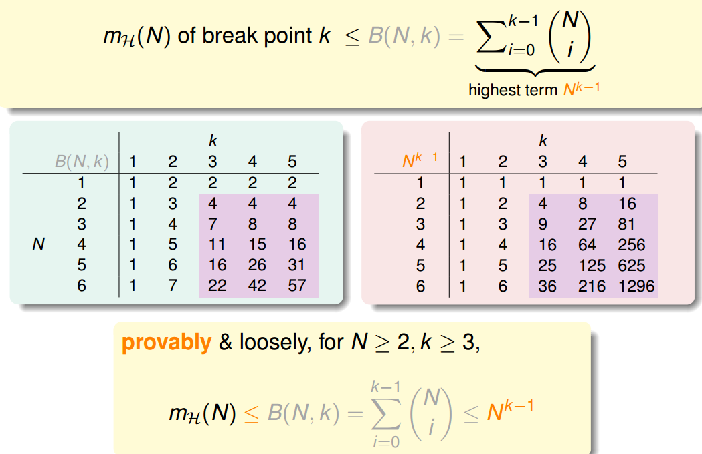  

则根据上一节课的推导，VC bound就可以转换为：  

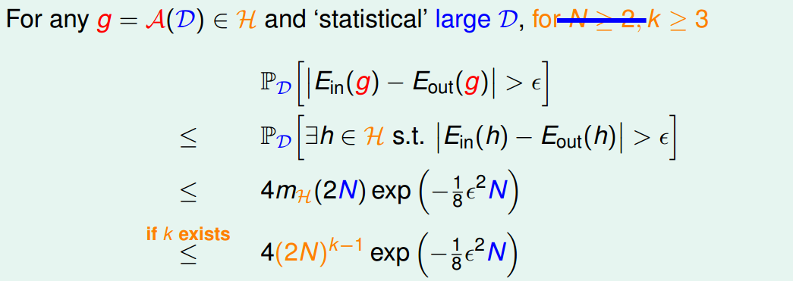  

这样，不等式只与k和N相关了，一般情况下样本N足够大，所以我们只考虑k值。有如下结论：  
- 若假设空间H有break point k，且N足够大，则根据VC bound理论，算法有良好的泛化能力  
- 在假设空间中选择一个矩g，使Ein ≈ 0 ，则其在全集数据中的错误率会较低  

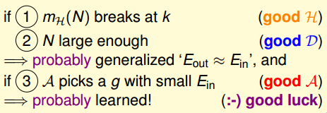  

下面介绍一个新的名词：VC Dimension。VC Dimension就是某假设集H能够shatter的最多inputs的个数，即最大完全正确的分类能力。（注意，只要存在一种分布的inputs能够正确分类也满足）。  

shatter的英文意思是“粉碎”，也就是说对于inputs的所有情况都能列举出来。例如对N个输入，如果能够将 2的N次方 种情况都列出来，则称该N个输入能够被假设集H shatter。

根据之前break point的定义：假设集不能被shatter任何分布类型的inputs的最少个数。则VC Dimension等于break point的个数减一。  

  

现在，我们回顾一下之前介绍的四种例子，它们对应的VC Dimension是多少：  

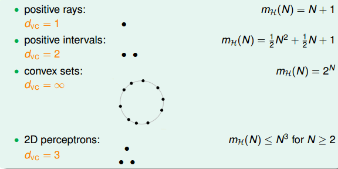  

用 dvc代替k，那么VC bound的问题也就转换为与dvc 和N相关了。同时，如果一个假设集H的 dvc确定了，则就能满足机器能够学习的第一个条件Ein ≈ Eout ，与算法、样本数据分布和目标函数都没有关系。  

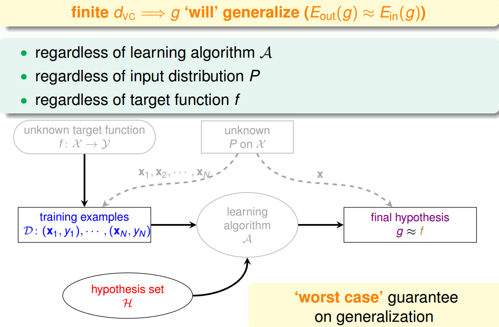  

## VC Dimension of Perceptrons

回顾一下我们之前介绍的2D下的PLA算法，已知Perceptrons的k=4，即dvc=3 。根据VC Bound理论，当N足够大的时候，Ein（g） ≈ Eout（g） 。如果找到一个g，使Ein（g） ≈ 0，那么就能证明PLA是可以学习的。  

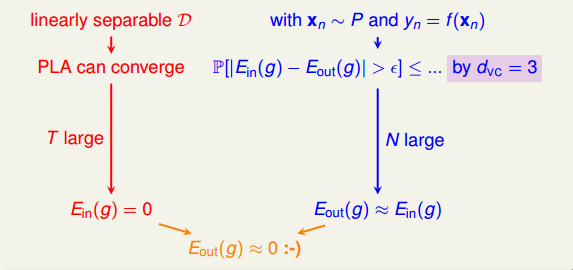  

这是在2D情况下，那如果是多维的Perceptron，它对应的 dvc 又等于多少呢？  

已知在1D Perceptron，dvc = 2 ，在2D Perceptrons，dvc = 3 ，那么我们有如下假设：dvc =d +1 ，其中d为维数。  
要证明的话，只需分两步证明：  
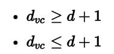  

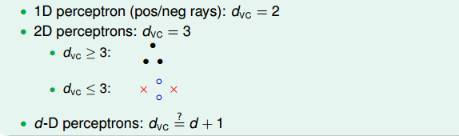  

首先证明第一个不等式： 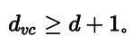  

在d维里，我们只要找到某一类的d+1个inputs可以被shatter的话，那么必然得到。所以，我们有意构造一个d维的矩阵 X能够被shatter就行。 X是d维的，有d+1个inputs，每个inputs加上第零个维度的常数项1，得到X 的矩阵：  
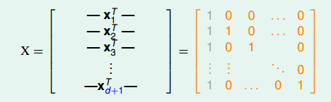  

矩阵中，每一行代表一个inputs，每个inputs是d+1维的，共有d+1个inputs。这里构造的 X很明显是可逆的。shatter的本质是假设空间H对 X的所有情况的判断都是对的，即总能找到权重W，满足 ，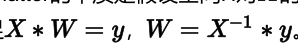 。由于这里我们构造的矩阵X的逆矩阵存在，那么d维的所有inputs都能被shatter，也就证明了第一个不等式。  

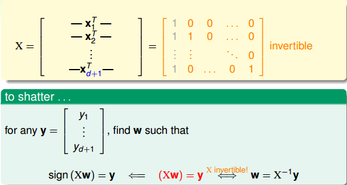  

然后证明第二个不等式：dvc ≤ d + 1 。  
在d维里，如果对于任何的d+2个inputs，一定不能被shatter，则不等式成立。我们构造一个任意的矩阵X ，其包含d+2个inputs，该矩阵有d+1列，d+2行。这d+2个向量的某一列一定可以被另外d+1个向量线性表示，例如对于向量Xd+2 ，可表示为： 
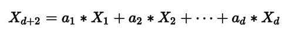  

其中，假设 a1＞0，a2，a3，...ad ＜0 .  
那么如果X1 是正类， X2,X3,...Xd均为负类，则存在W ，得到如下表达式： 
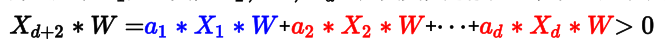  

因为其中蓝色项大于0，代表正类；红色项小于0，代表负类。所有对于这种情况，  

Xd+2一定是正类，无法得到负类的情况。也就是说，d+2个inputs无法被shatter。
证明完毕！  

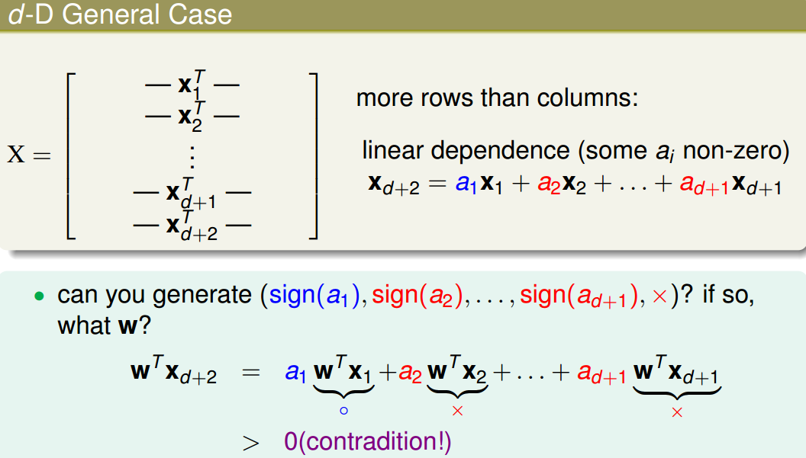  
综上证明可得 dvc = d +1。  

## Physical Intuition VC Dimension

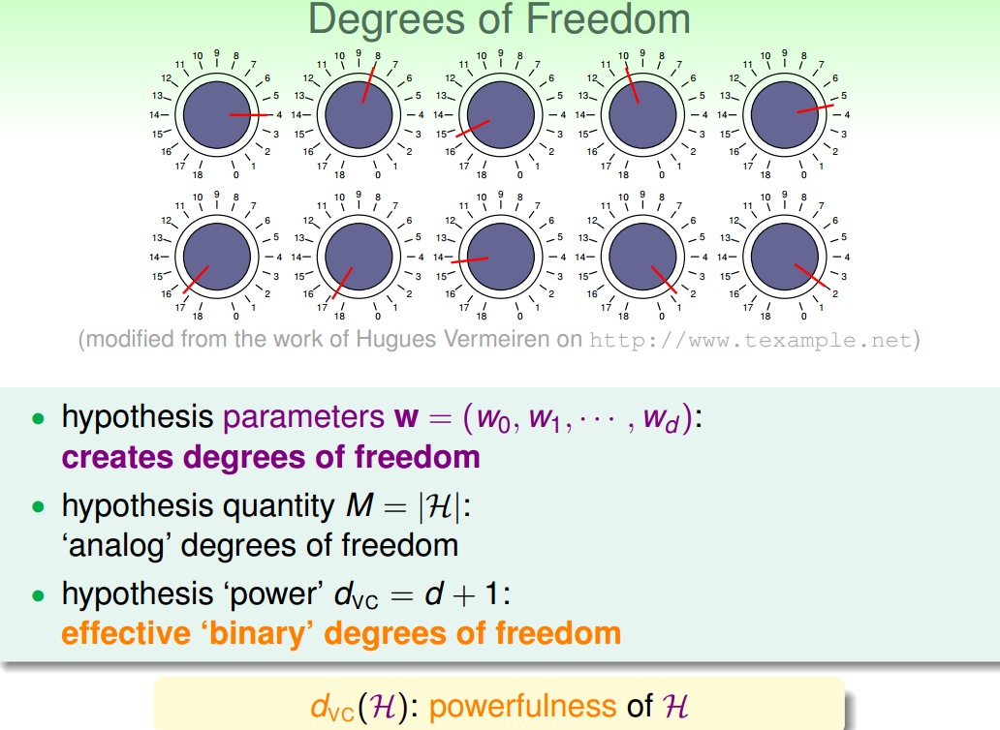  

上节公式中W 又名features，即自由度。自由度是可以任意调节的，如同上图中的旋钮一样，可以调节。VC Dimension代表了假设空间的分类能力，即反映了H的自由度，产生dichotomy的数量，也就等于features的个数，但也不是绝对的。  

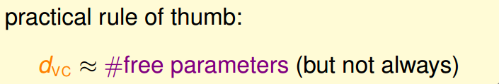  

例如，对2D Perceptrons，线性分类，dvc = 3 ，则 W=｛w0,w1,w2｝，也就是说只要3个features就可以进行学习，自由度为3。

介绍到这，我们发现M与 dvc是成正比的，从而得到如下结论：  

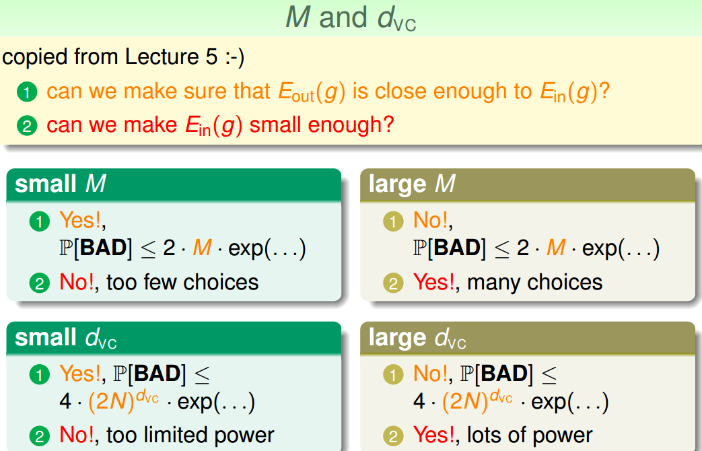  

## Interpreting VC Dimension

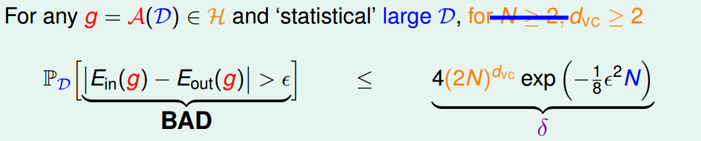  

根据之前的泛化不等式，如果 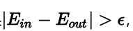即出现bad坏的情况的概率最大不超过δ 。那么反过来，对于good好的情况发生的概率最小为1-δ ，则对上述不等式进行重新推导：  

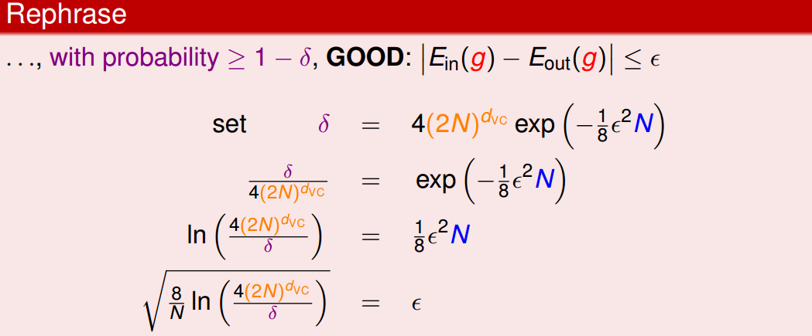  

ε表现了假设空间H的泛化能力，ε 越小，泛化能力越大。  

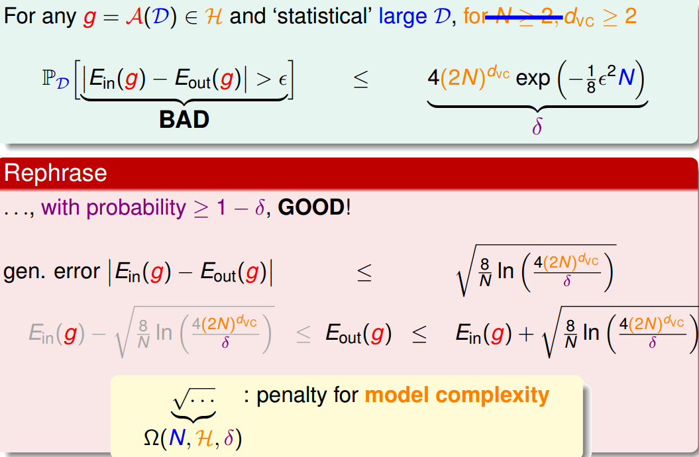  

至此，已经推导出泛化误差 Eout的边界，因为我们更关心其上界（ Eout可能的最大值），即：  

  

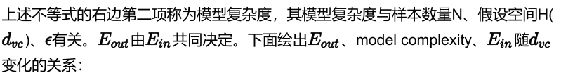  

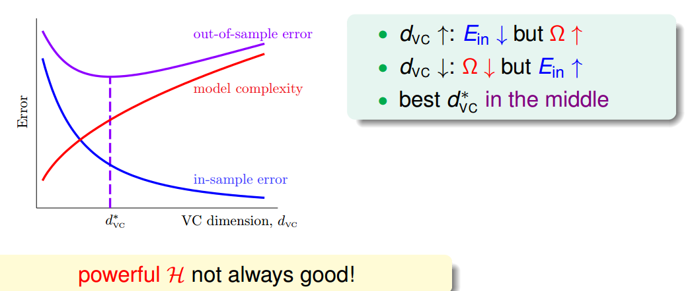  

通过该图可以得出如下结论：  

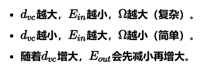  

所以，为了得到最小的Eout ，不能一味地增大dvc 以减小Ein ，因为Ein太小的时候，模型复杂度会增加，造成Eout 变大。也就是说，选择合适的dvc ，选择的features个数要合适。  

下面介绍一个概念：样本复杂度（Sample Complexity）。如果选定 dvc，样本数据D选择多少合适呢？通过下面一个例子可以帮助我们理解：  

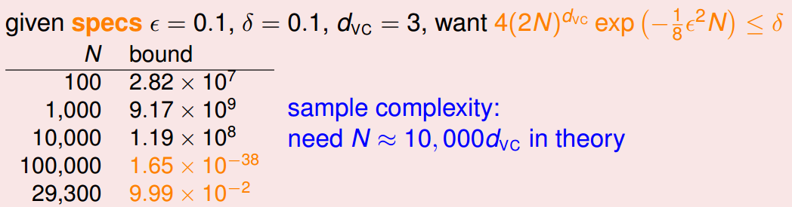  

通过计算得到N=29300，刚好满足 δ = 0.1的条件。N大约是dvc 的10000倍。这个数值太大了，实际中往往不需要这么多的样本数量，大概只需要dvc 的10倍就够了。N的理论值之所以这么大是因为VC Bound 过于宽松了，我们得到的是一个比实际大得多的上界。  

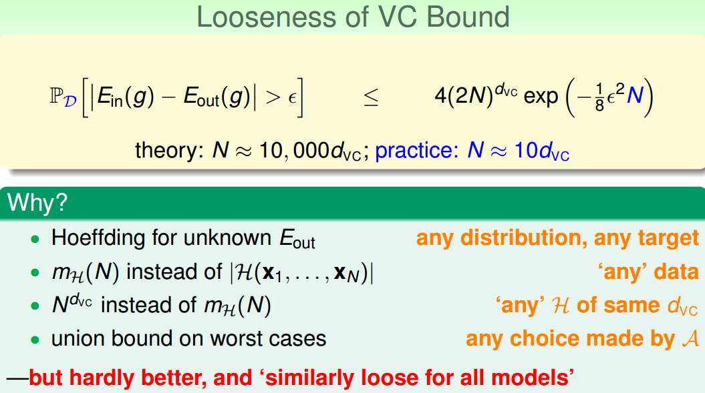  

值得一提的是，VC Bound是比较宽松的，而如何收紧它却不是那么容易，这也是机器学习的一大难题。但是，令人欣慰的一点是，VC Bound基本上对所有模型的宽松程度是基本一致的，所以，不同模型之间还是可以横向比较。从而，VC Bound宽松对机器学习的可行性还是没有太大影响。  

## 总结

本节课主要介绍了VC Dimension的概念就是最大的non­break point。然后，我们得到了Perceptrons在d维度下的VC Dimension是d+1。接着，我们在物理意义上，将dvc与自由度联系起来。最终得出结论 不能过大也不能过小。选取合适的值，才能让Eout足够小，使假设空间H具有良好的泛化能力。  
