## 笔记9 ­­ Linear Regression  
课程位置：https://www.bilibili.com/video/av85507974  

>上节课，我们主要介绍了在有noise的情况下，VC Bound理论仍然是成立的。同时，介绍了不同的error measure方法。本节课介绍机器学习最常见的一种算法：Linear Regression.  

## 线性回归问题

在之前的Linear Classification课程中，讲了信用卡发放的例子，利用机器学习来决定是否给用户发放信用卡。本节课仍然引入信用卡的例子，来解决给用户发放信用卡额度的问题，这就是一个线性回归（Linear Regression）问题。  

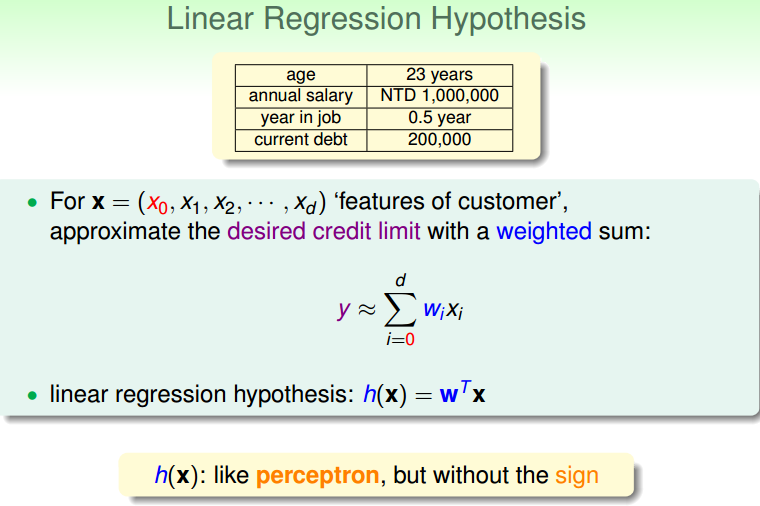  

令用户特征集为d维的X ，加上常数项，维度为d+1 ，与权重w 的线性组合即为Hypothesis,记为h(x) 。线性回归的预测函数取值在整个实数空间，这跟线性分类不同.  

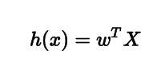  

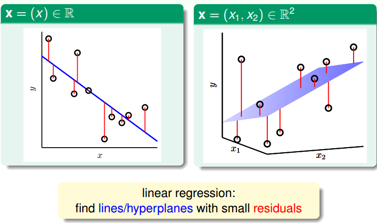  

根据上图，在一维或者多维空间里，线性回归的目标是找到一条直线（对应一维）、一个平面（对应二维）或者更高维的超平面，使样本集中的点更接近它，也就是残留误差Residuals最小化。  

一般最常用的错误测量方式是基于最小二乘法，其目标是计算误差的最小平方和对应的权重w，即上节课介绍的squared error：  

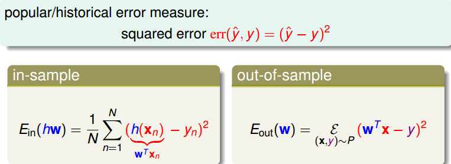  

这里提一点，最小二乘法可以解决线性问题和非线性问题。线性最小二乘法的解是closed­form，即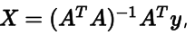 ，而非线性最小二乘法没有closed­form，通常用迭代法求解。本节课的解就是closed­form的。  

## 线性回归算法

样本数据误差Ein 是权重 w 的函数，因为 X和 y都是已知的。我们的目标就是找出合适的w ，使Ein 能够最小。那么如何计算呢？  

首先，运用矩阵转换的思想，将 Ein 计算转换为矩阵的形式。

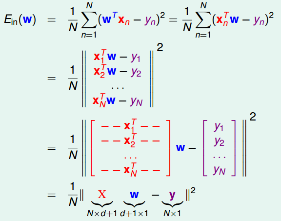  

然后，对于此类线性回归问题， Ein(w)一般是个凸函数。凸函数的话，我们只要找到一阶导数等于零的位置，就找到了最优解。那么，我们将 Ew对每个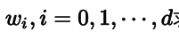求偏导，偏导为零的wi ，即为最优化的权重值分布。  

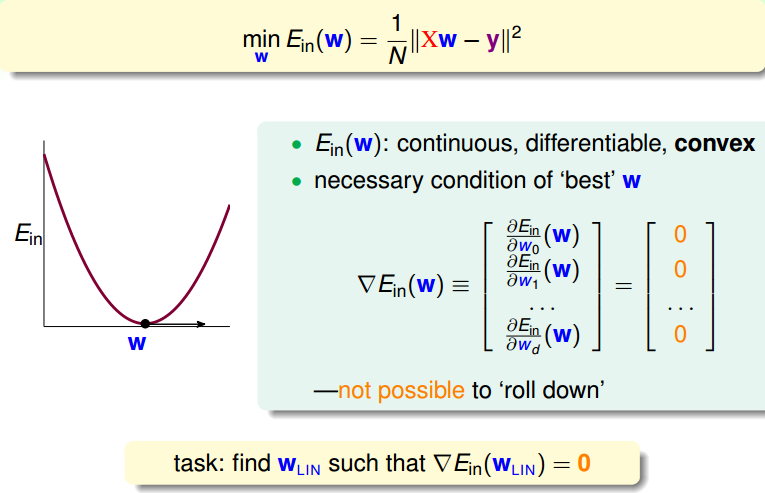  

根据梯度的思想，对Ew 进行矩阵话求偏导处理：  

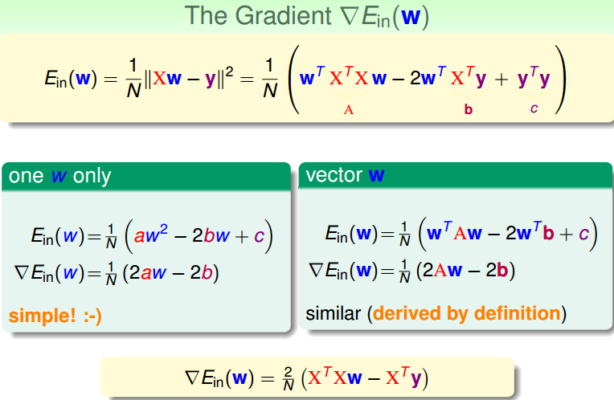

令偏导为零，最终可以计算出权重向量 w为：  

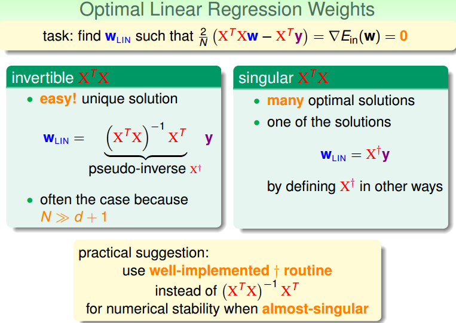  

最终，我们推导得到了权重向量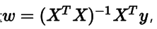 ，这是上文提到的closed­form解。其中， 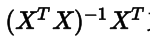又称为伪逆矩阵pseudo­inverse，记为 X+，维度是(d+1)xN。  

但是，我们注意到，伪逆矩阵中有逆矩阵的计算，逆矩阵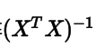 是否一定存在？一般情况下，只要满足样本数量N远大于样本特征维度d+1，就能保证矩阵的逆是存在的，称之为非奇异矩阵。但是如果是奇异矩阵，不可逆怎么办呢？其实，大部分的计算逆矩阵的软件程序，都可以处理这个问题，也会计算出一个逆矩阵。所以，一般伪逆矩阵是可解的。  

## 泛化问题

现在，可能有这样一个疑问，就是这种求解权重向量的方法是机器学习吗？或者说这种方法满足我们之前推导VC Bound，即是否泛化能力强Ein ≈ Eout ？  

  

有两种观点：1、这不属于机器学习范畴。因为这种closed­form解的形式跟一般的机器学习算法不一样，而且在计算最小化误差的过程中没有用到迭代。2、这属于机器学习范畴。因为从结果上看， Ein和Eout 都实现了最小化，而且实际上在计算逆矩阵的过程中，也用到了迭代。  

其实，只从结果来看，这种方法的确实现了机器学习的目的。下面通过介绍一种更简单的方法，证明linear regression问题是可以通过线下最小二乘法方法计算得到好的Ein和Eout 的。  

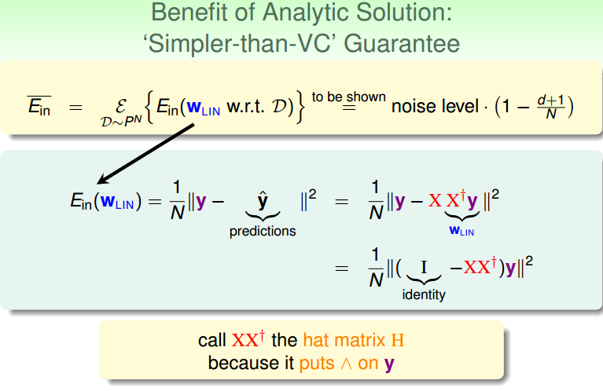  

首先，我们根据平均误差的思想，把 写成如图的形式，经过变换得到:   

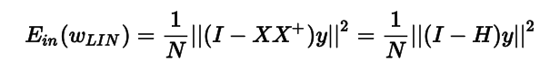  

我们称XX+ 为帽子矩阵，用H表示。  

下面从几何图形的角度来介绍帽子矩阵H的物理意义。  

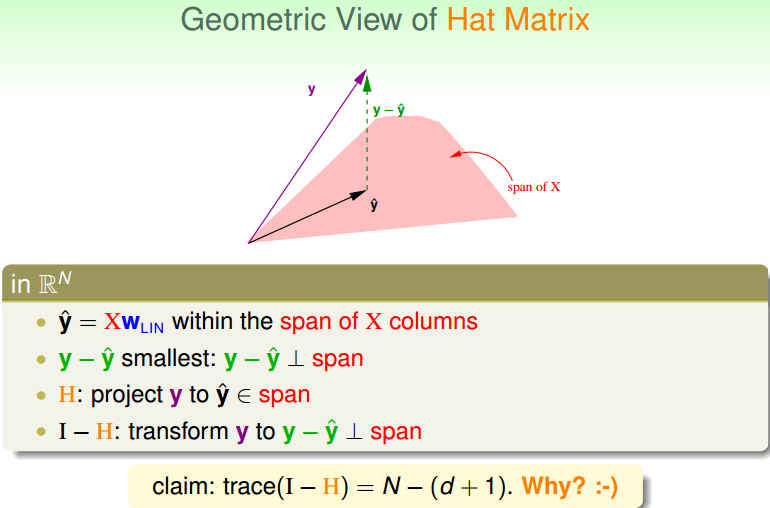  

图中，y是N维空间的一个向量，粉色区域表示输入矩阵X乘以不同权值向量w所构成的空间，根据所有w的取值，预测输出都被限定在粉色的空间中。向量 就是粉色空间中的一个向量，代表预测的一种。y是实际样本数据输出值。  

机器学习的目的是在粉色空间中找到一个 ，使它最接近真实的y，那么我们只要将y在粉色空间上作垂直投影即可，投影得到的 即为在粉色空间内最接近y的向量。这样即使平均误差 最小。  

从图中可以看出， 是y的投影，已知 ，那么H表示的就是将y投影到 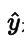的一种操作。图中绿色的箭头 是向量y与 相减， 垂直于粉色区域。已知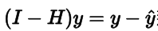那么I­H表示的就是将y投影到 即垂直于粉色区域的一种操作。这样的话，我们就赋予了H和I­-H不同但又有联系的物理意义。  

这里trace(I­-H)称为I-­H的迹，值为N-­(d+1)。这条性质很重要，一个矩阵的 trace等于该矩阵的所有特征值(Eigenvalues)之和。下面给出简单证明：  

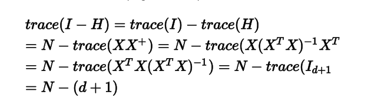  

介绍下该I-­H这种转换的物理意义：原来有一个有N个自由度的向量y，投影到一个有d+1维的空间x（代表一列的自由度，即单一输入样本的参数，如图中粉色区域），而余数剩余的自由度最大只有N­-(d+1)种。在存在noise的情况下，上图变为：  

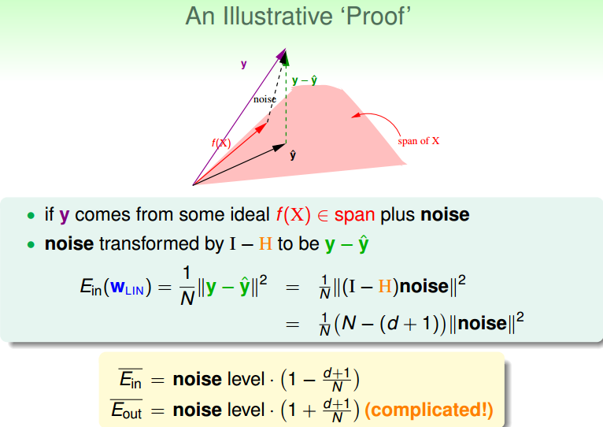  

图中，粉色空间的红色箭头是目标函数f(x)，虚线箭头是noise，可见，真实样本输出y由f(x)和noise相加得到。由上面推导，已知向量y经过I­-H转换为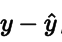 ，而noise与y是线性变换关系，那么根据线性函数知识，我们推导出noise经过I-­H也能转换为 。则对于样本平均误差，有下列推导成立：  

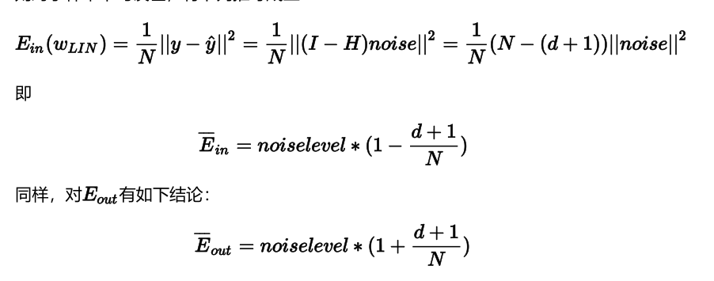  

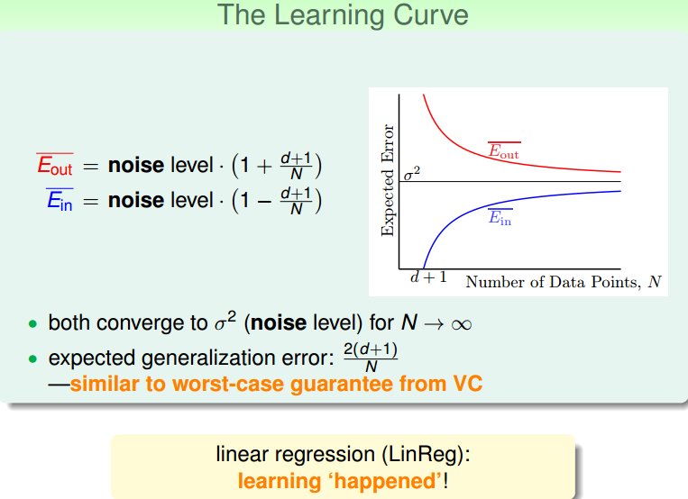  

当N足够大时， Ein与Eout 逐渐接近，满足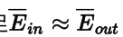 ，且数值保持在noise level。这就类似VC理论，证明了当N足够大的时候，这种线性最小二乘法是可以进行机器学习的，算法有效！  

## Linear Regression方法解决Linear Classification问题  

之前介绍的Linear Classification问题使用的Error Measure方法用的是0/1 error，那么Linear Regression的squared error是否能够应用到Linear Classification问题？  

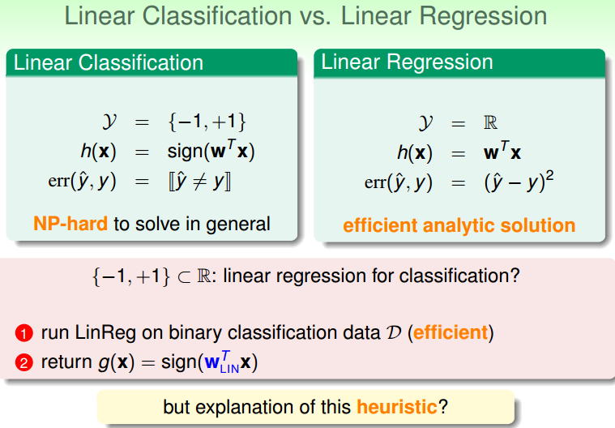  

下图展示了两种错误的关系，一般情况下，squared error曲线在0/1 error曲线之上。即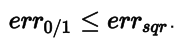  

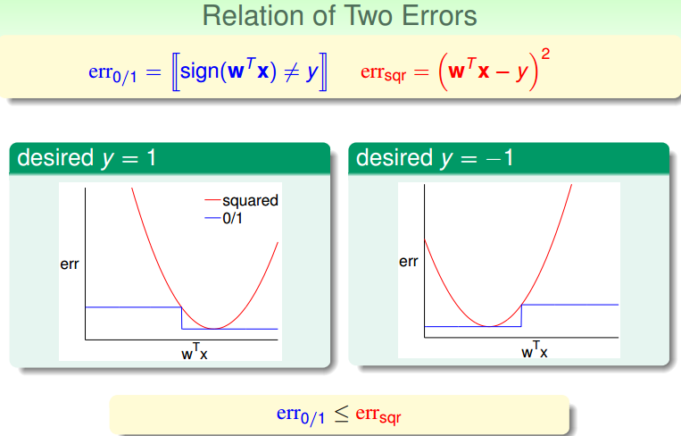  

根据之前的VC理论， Eout的上界满足：  

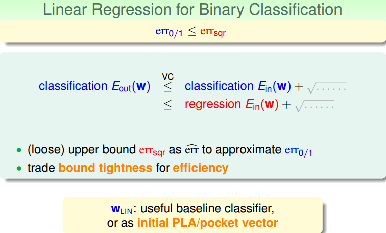  

从图中可以看出，用 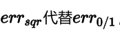 ， Eout仍然有上界，只不过是上界变得宽松了。也就是说用线性回归方法仍然可以解决线性分类问题，效果不会太差。二元分类问题得到了一个更宽松的上界，但是也是一种更有效率的求解方式。  

## 总结

本节课，我们主要介绍了Linear Regression。首先，我们从问题出发，想要找到一条直线拟合实际数据值；然后，我们利用最小二乘法，用解析形式推导了权重w的closed­form解；接着，用图形的形式得到 ，证明了linearregression是可以进行机器学习的，；最后，我们证明linear regressin这种方法可以用在binary classification上，虽然上界变宽松了，但是仍然能得到不错的学习方法。  
