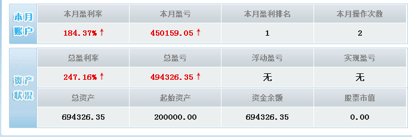
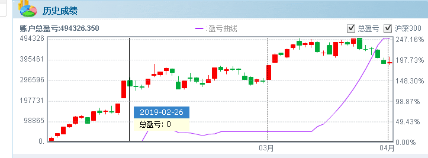
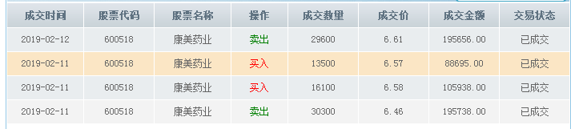
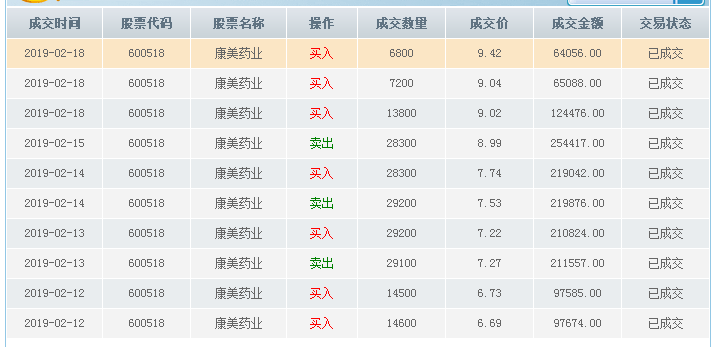
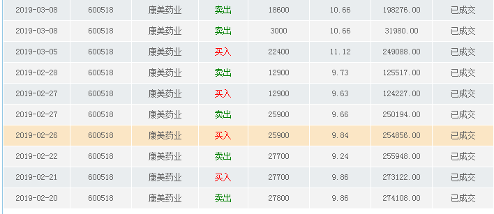
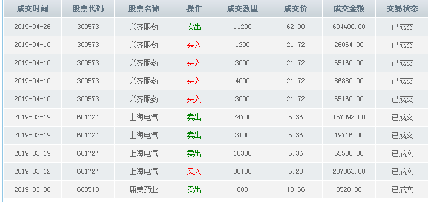

## 使用TensorFlow进行金融投资

代码部分已经完成,正在测试效果,  
但是在实际投资中我本人也使用了部分意见,但是掺杂了我对信息的理解(毕竟本科毕业于经管金融),没有完全使用此代码结果,  
so我打算重新注册一下同花顺或者其他模拟投资,设置一个底额为投资起点,看一段时间内(三个月--六个月),看效果如何?

-----
上传测试图片 截止2019-04-30投资记录为:  

图一是同花顺模拟炒股的本月收益和资产状况.和我本人真实投资情况,相差还是比较远的,这是完全安装tf-investion项目的要求来的,d+1 大家都知道的.  
此账号注册时间大约是2019-01,本来就是为了这个模拟炒股,我本人的话是不使用此软件的,见仁见智.  

初始资金是20,0000,每个账号都是如此,到最后(4月底)总盈亏为494326.35,总资产为694326.35  

  

图二为趋势图.  

  

下列为具体操作和时间,成交数量和价格.  
2019-02-11 ~ 2019.04.26  
  

    

  

  

-----
2019年5月2日  
ps:学生们还问我怎么入门金融股票投资财管这些领域,  
我问为什么想学这些  
他们说技术不够吃的了  
...  
好吧,其实技术还真的不够吃的了,技术人员(比如说程序猿)越来越多,工价也愈发上不去,别说财务自由,一个人养四个老人加家庭主妇一个娃的话,真的很难,  

但是一点要强调的一点是  
<b>投资有风险</b>  

这并不是开玩笑,不是戏谑的说一句"亲人两行泪"的那种,见过无数的人受到投资的诱惑,失去理智,家破人亡.  

这有悖于我的初衷了... 
