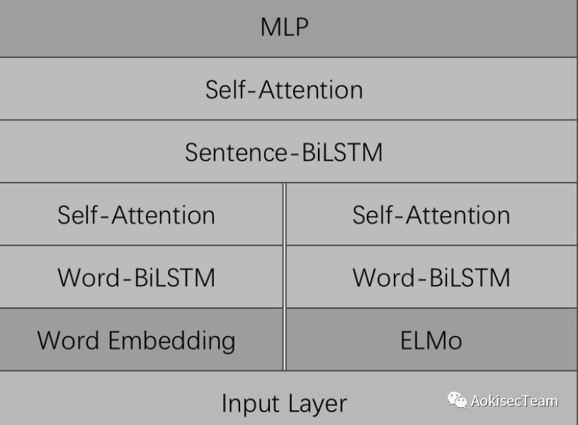
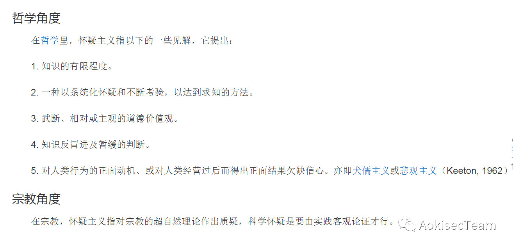
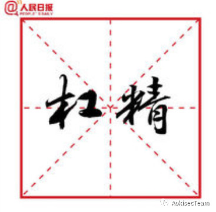

## "安全圈"与"娱乐圈"

我比较少看新闻，或者说我感兴趣的新闻并不在娱记上面，这些事情本身跟我也没有一毛钱关系，但是被安全圈一些“人”员的三观观点论据惊到了，就有了以下此文此操作。  

  


先说下论调地位，我一直觉得不声明知识构成和阶层地位的论点论据是一种流氓行为，不可能存在完全理性或完全感性行为。本人硕士于某大学马院哲学系，曾经辩论赛任二辩手，无产阶级，辩证唯物主义者。现工作于某信息安全及人工智能实验室。  

事件为美某女起诉某东QJ案。起因不详。  

我这里对案件本身并不评价，不判断，只对“人”的论点论据做论。先声明，所谓“人员”“人士”均无特指，也不是一个两个人而是许多人，群里的对话，下文的“他”“人”均是我方便的指示代词而已。  

安全圈某人士，下简称“人”，原文截图引用他的原观点，并无断章取义，但是为了不暴露别人的id和微信群，就不截图到此，如希望自证清白，可以向我索要证明观点截图。为了证明我没有主观上断章取义，我使用NLP技术基准的语义分割，文本情感分析(主倾向性挖掘分析)以及情感识别这套我本人参赛项目作为我排除感情用事的办法之一（竞赛成绩3/3662），本项目使用了深度学习的HAN+ELMo模型（在优化的时候还充分参考了ULMFit和BERT）和自写自优化的T-DPCNN，半监督方案为假标签pseudo label，相关技术还有hinton的蒸馏方法，交叉验证+oof训练集，最初参考模型包括LSTM/GRU 、CNN 、Capsules、 Max-pooling、 Attention等，下图为HAN+ELMo的第二次设计的向量拼接模型结构图。（技术一时半会说不清楚~也不详尽说了，之后说不定会放出来）  
  


此外本项目的另一版本是推/t的情感分析，分析出特朗普推t不是两个人以上发的就是精神分裂，后证有助理发言人XX等。本来还想为此次“撕逼”加入ai人物画像和大数据关联，算了，没必要。  

以上技术手段 下面开始阐述，格式为“人”+数字，数字为NLP判断的观点序号：  

```
“人”1：“一个好好学生不在学校，宿舍/n去酒吧只能怪她去错了地方”

“人”2：“物以类聚”

“人”3：“运气也是成功的一部分”

“人”4：“不要断章取义”

“人”5：“吃饭完就走了不就行了，还陪玩?且怎么就跟着到房间了”

“人”6：“我只知道一个巴掌拍不响”

“人”7：“因为没人可以定论是真是假，有视频?还是啥?法院有起诉状?”

“人”8：“我绝对不会带感情色彩做事”

“人”9：“我只是说事实，物以类聚，我大部分的朋友，很多一辈子都没去啥ktv，我也从来没去过酒吧，酒吧。就是和各种大佬一起吃饭都是吃完就散了，实在想不到男女会跟到家里或者酒店啥的，除非情侣...”

“人”10：“有钱人缺女人吗？”

“人”11：“我说的是概率问题，很大可能是假的，不排除是真的”

“人”12：“国家的安定比任何都重要，第一条就是不可以引起大范围的思想动荡。”

“人”13：“再说就没一家公司好的了，都是剥削。就是政治问题了。我不喜欢政治”

“人”14：“我不需要问，每个人有每个人想法，我并不偏袒任何人，我只知道谁错都该处罚。现实确实是大部分人素质很低，是事实。”

“人”15：“现在这社会本来就没几个好女孩了。反正我一个都没遇到。。和阴谋论有jb关系”

“人”16：“别扯上政z问题”（ps 这个是我手动补全中文的。）

“人”17：“哪个企业的建立，王朝的建立不是血流成河”

“人”18：“你怎么进这个圈子的?”
```

以上为观点提取，尽管有些是疑问句式，但是上下文判断是反问。  

正确观点：3 4 11  

我站在外面提出一些观点，不指名是具体是哪个观点了，也是对我自己的一种反思和精进。  

某观点明显犯了先入为主和思维定势的主观错误，将犯罪问题分类回归，但是犯罪行为本身具有相当不可确定性，犯罪发起人和被动参与人本身就不存在必要必然联系。（具体参考《刑法通论》）  

某观点明显犯了诉诸感情（appeal to emotion）的非形式谬误，试图通过操作别人感情来取代一个有力论述。操作的感情包括恐惧嫉妒怜悯骄傲等。（详尽参考《诉诸理性及诉诸感情》）  

某观点明显犯了诉诸恐惧/无知/阴谋（Appeal to fear）的逻辑错误，通过一些反证或未被证明，或断定一件事物错误，只因没被证明是正确的，即无知或者阴谋的观点。（参考《心理学》《变态心理学》或者其他心理咨询师教材）  

某观点明显犯了滑坡谬误（Slippery slope）的非形式谬误，也就是使用了连串的因果推论，却夸大每个环节的因果强度，而得到不合理的结论。经典此错误观点为“小红认为xx屠夫喜欢杀猪，以后就会杀人”。（详尽参考《形式逻辑》《滑坡论证》）  

某观点犯了诉诸虚伪，即不正面回应别人对你的批评，而是批评别人作为你的回复。通过批评回应批评，达到免去为自己辩护的责任。经典论调：“不要大声讲话”“你不也在讲话？”（杠精必修课之一 参考《形式逻辑》）  

某观点犯了个人怀疑/怀疑主义主观错误。（百度百科 截图）  



某观点犯了片面谬误，观点被论证时，使用特例为自己开脱，否认了马克思唯物辩证法的普遍性与特殊性统一的观点。经典观点：“孩子还小，不懂事，谁家的孩子不调皮”“我虽说考试作弊但是我爱国啊，我抄袭你的作品了，但是红了啊你也因此红了啊，不然谁知道你啊”（《简单逻辑学》《形式逻辑》《黑格尔的辩证逻辑》基本上讲辩证的书籍都有，以前上学的形势与政策都有）  

某观点犯了乐队花车（bandwagon）逻辑错误，就是所谓从众心理。（《形式逻辑》）  

某观点犯了明显的基因谬误，用最简单的句子表述，也就是攻击来源，而不攻击内容。一个经典的例子“你爸是贼，你也是贼”“龙生龙 凤生凤，老鼠的儿子会打洞”“物以类聚人以群分”此观点当时我在辩论的时候也是争议最大的观点，基于正统生物学的观点，龙凤鼠均是有其生物特性，其生物特性划分种族也是长期存在的观点，所以在辩论和哲学上提及这个观点的话，必须要声明其用引申义，不做引物本身释义。（《形式逻辑》《归纳推理》等书有，但是新版中删除了此观点，不知道是否改名了。）  

某观点犯了完全理性（Entirely Rational）/完全感性这种绝对值错误。完全理性观点早在1930到现在被证伪，比如凯恩斯《通论》的观点“行为人的行动受到理性驱使也受感性因素”；卡尼曼(Kahneman)结合行为科学和经济心理学的观点同样也认为，行为人的行动受到直觉和推理两个系统的影响；西蒙的“行为人不具备完全计算逻辑推理能和测未来”还有特韦尔斯基(Amos Tversky)详尽地对选择的描述不变性、程序不变性和前后关系独立性假设；除了经济学家们的证伪，其实还有马克思恩格斯列宁等也均证伪了，可以参考《实践的理性和理性的实践马克思实践理性思想探析》和《自然辩证法的研究》两本都是国人写的好懂一点。。。对了还有罗素悖论和数学公理化这一历史，都是证伪的材料... ...  

某观点... ...  

其实还有很多，但是实在是不想一一分析了，没什么意义，我也是无聊，就导出个微信群聊记录，测试下我的竞赛实战项目。仅此而已，也没想说要抨击谁谁谁，我也没资格，更不是贵圈的。说不定之后有时间有空基于知识图谱做一个“撕逼”“扛精”专用的KBQA什么乱七八糟的。对本文设计人员 技术 人品以及其他内容均不予回应。（ps 顺带一说，1080ti真是给力，gpu吃满超级爽）  

  

长按关注一个用人工智能去研究哲学的男子  


### link

[微信公众号-aokisec-team](https://mp.weixin.qq.com/s?__biz=MzIzMDYyNzMyNg==&mid=2247483796&idx=1&sn=1c291e048a6cb3f2c4f63c9c12365b69&chksm=e8b1c305dfc64a13ecc3e0c8c74f7fddfd23942c35de6ab61c369ff076075d7c55291d3548f1&token=994086036&lang=zh_CN#rd)
