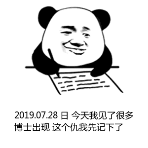

## 记一次不久(上)

算是个人习惯,我即使没做好准备去新的地方工作,还是很愿意去收集一下面试笔试等相关信息,使自己也不会落后时代太久.今天也试了一试,由于以下内容将会带上我个人色彩和瞎逼逼,且此企业&大学均是国内相当知名的,所以将隐去相关名称和可能泄密的内容.(本文不含技术题目内容)  

  
先行介绍下前提环境,此次招聘是面向社会和学校,ai算法博士岗,要求分为两种,我就简单用个代称来统一分类,一是组长, 二是组员,组员是投简历即可,组长是内部推荐制,特别一点的要求就是在读博士 博士等,其他的都算是正常需求,什么编程语言开发经验论文等都正常.还有比较特别的一点就是薪资...90-210w纯年薪不包括其他...  

  

我去到的时候大概是早上九点多, 就发现报告厅内已经人声鼎沸了,貌似也没到我, 就去和众多博士们交流下.对了我是被熟人推荐组长一岗,也是啥都没有准备,我见各位博士们都是准备得相当详尽,我本以后是博士才能去,还深深感慨现在的博士还真的多,不由得想起玄幻小说内一句"圣人多如狗,神阶遍地走"的感jio,后面发现约有70%都是在读博士,都是读博三年左右的(幸好但是学历还是碾压我),我是个菜鸡来混的,非博士&在读博士,除了我好像还有三个是硕士学历,但是都好像是想继续读博的,毕竟AI你懂得...  
  

一时之间还没见过这么多博士,我就渴望简单和他们交流一下:  
`我估计我的表情是这样的`  

  

我算是个务实派吧,我讨论的都是具体实践的方法,或者是生产的既有成果,像我这种半路出家的混的菜鸡,我就加入了几个博士讨论的临时小组(其实就是别人在讨论我去旁听~)  

然后发现他们在讨论全部是论文,各种期刊啊 会议啊 组织啊,等等等等,我看了一下门口的招聘要求,不是真正实际应用生产么,我就假装咳嗽一声,"各位大佬不做生产应用么",霎时诸位大佬看着我,犹如看着一个傻逼,"什么玩意儿","什么几把","... ..."  

我就简单介绍了我的一些应用,(大家都知道,假如你有三个学历,肯定会说最知名的那个),我就说了之前在aaai和github发的一个项目,被几个商业公司想买,最后卖给了国内一家知名公司(STKJ),大致是将一个玩意由学术地步的30%提升至商用的96%,且基本可以直接予以工业实践.  

嗯,交流部分就在这种尴尬的氛围中结束了.  

  

然后就到面试的时刻了.  

首先是面试官,有六个,一个人事,一个领导(也是个技术领导),四个技术.  
一上来就和我声明了具体的要求和职责,我简单理解下,这岗位算是三岗合一,实验室人事主管(少量)+研发主管(80%)+管理负责人(20%),还是技术占主要部分.  

他的研发技术构成和技术栈是相当复杂的,笔试面试分为两部分,其中管理部分的估计大家也没什么兴趣和难度,主要是技术的,技术面试之前已经电面(电话视频微信)很多次了,加上我是带着项目来的,所以,今天给我的当面的题目是三道算法题,和两道实际题(就是他们在技术中遇到的实际问题,他们描述出来,并已经解决一个了),并不是要求立刻解决的.可以思索一段时间,他们说的是尽快...也没给时间..然后在那坐到下午六点多...  

#### 我并没有当场做出来...直到现在也没有...  

目前的进度是搭建好了复测环境docker,暂时没有什么思路  

如果还有记一次不久(下),就是以上题目的内容和解法.  

但是之前也说过,这次题目不能和之前一样发原题出来,很多涉密内容,都是工业实际生产的玩意儿,我正考虑怎么说...  
水并吐槽一波...  

  
