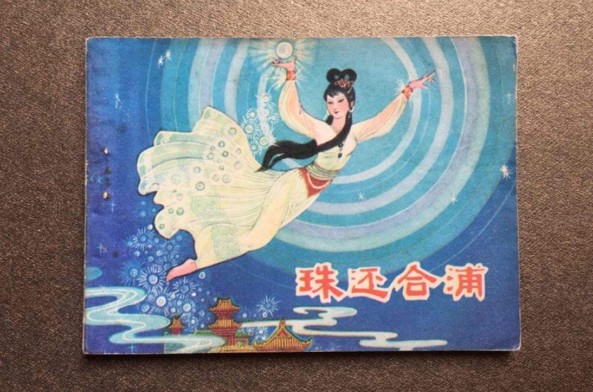
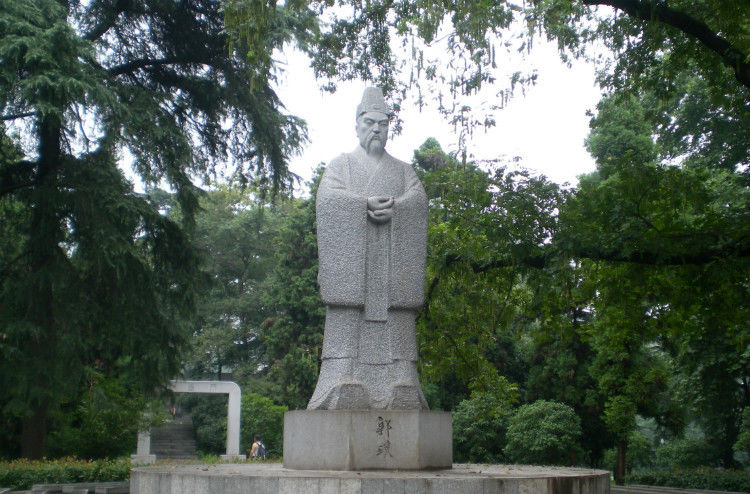
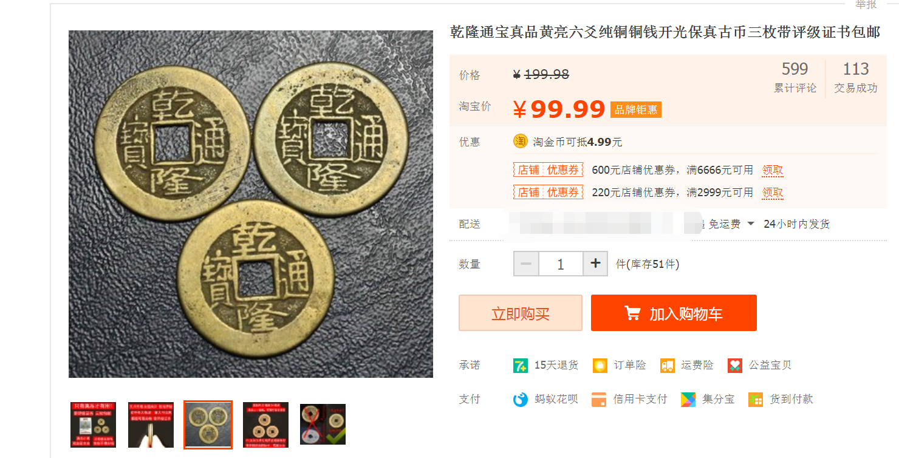
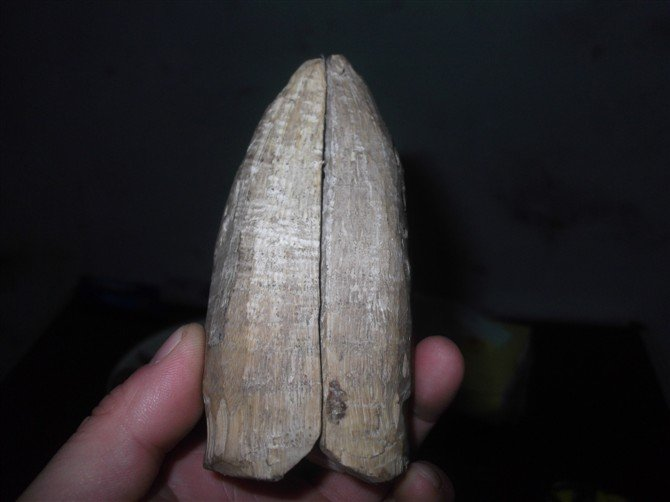
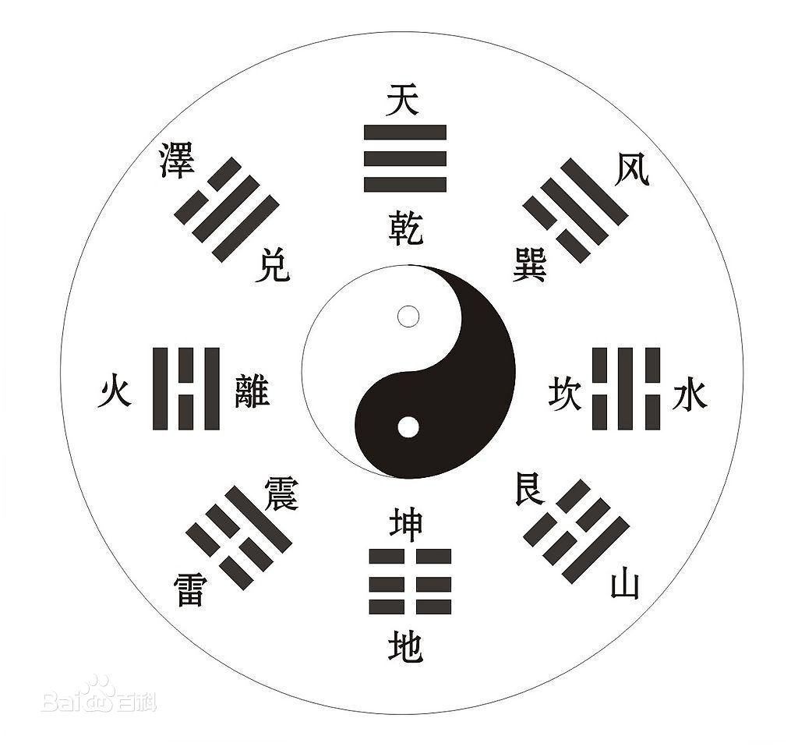
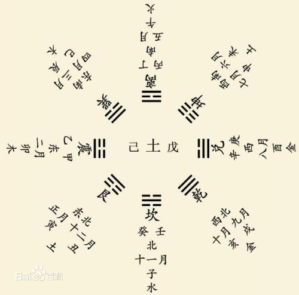
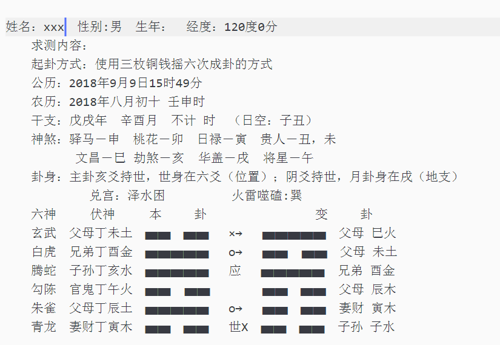

### 记一次卜卦

#### 前言

我也算是杂家出身了,这次且不论AI和安全,不论学界和行界,也不论论文和成果,不论时政和经济,权当作记叙最近的一些事,供诸君一乐.  

  

#### 自我

出身卑微,以前搞过一段时间所谓的"江湖术士"的学习,很久没向人提起过,尤以为知识分子之耻.然后随着在大学期间的一些见识和去其他大学浏览一番之后,对自身的一些观念有所变化;我发现越是高知识分子越是相信一些人们不相信的东西,比如我这次想说的:"封建迷信"中的 "术数"中的 "风水术"  "相术" "六爻术"等.  

先行说明下,我并不是在某某道观,或者某某专业组织系统学习过,我家住一个非常迷信非常落后非常贫穷的地方,小时被迫学习过一段时间,以此为基础的自学,且我只会看阴阳宅,并没有进行"相人" "算命改运" "卜卦"之类的操作,会不会归一边,没有实操过.且我经师不到学艺不精一知半解一孔之见,做不到入骨三分,也难面面俱到.  

  

而且我也确实没有什么成绩,现在几乎看不了阳宅了 很多都是板式房了,只能在内部稍微改改影响不大,阴宅的话,谁会让一个不是很懂的小孩子来看呢?所以我看了我自己的,复现了先生给我爷爷奶奶看的祖先看的阴宅.即使给人看,说三留七,不收分文,只求自保,技艺不到,岂敢求财.  

最近真的诸多不顺,应该说不仅仅是最近而已,相当长一段时间了,且说19年,今年并非是我的本命年,是我弟弟的本命年,当然我也不敢帮他算.只是一些众所周知理所应当的规劝而已.而我自己的话,就不知如何言表了.现在的情况真的就是"欲前不前,想退不退,居左偏右,往右心左",犹犹豫豫,不成事.  

  

遇到的事情有:事业不顺;成家不顺;车祸;搬家遇丧事;散财;遗失多样重要物品;友断交;频繁见红;人屎浇头;摔断脚电梯坏住17楼;各种生病;噩梦连连;夜晚遇蛇;等等...(熟悉我的朋友都知道,我的身份证饭卡钥匙之类的物品从没有遗失过)  

#### 交代

先生也曾言到"信则有不信则无",孔圣也有话语 "子不语怪力乱神";信与不信皆在一念,你我都对这些不需要深究一些事情的真伪是非了.  

  

#### 卜卦

我用的道具只是:笅杯竹卦和铜钱,断法是打卦法和六爻中文王六四卦和原本的阴阳爻八卦法;我没有卦盘,我手画了一个,过程的话,大致是简化的大衍筮法(铜钱摇卦),大约过程为取三枚铜钱,放于手中，双手紧扣，思其所测之事，合掌摇晃后放入卦盘中，掷六次而成卦。配以卦爻，及动变以后。通过测卦当日的干支，配以六亲及六兽，主要依靠用神的五行生旺，结合易经的爻辞而判断.此法出处为麻衣道者的<<火珠林>>.铜钱的话,就"乾隆通宝"即可.  
六爻记法:  
一个背，两个字，称作“单”．画作“ ▅▅▅▅▅ ”为少阳。  
两个背，一个字，称作“拆”，画作“ ▅▅　▅▅ ”为少阴。  
三个背，没有字，称作“重”，画作“ ▅▅▅▅▅ O”为老阳，是变爻。  
三个字，没有背，称作“交”，画作“ ▅▅　▅▅ X”为老阴，是变爻。  

  

随便找一个淘宝店,销量差不多就行了.毕竟真品的话也不是我一个卑微之人能用的.  

然后"笅杯竹卦"的话,我认为符合阴阳九宫八卦即可,但是有些先生认为要经年使用,传承几百年的才为上品,这也不是我这种卑微之人能启用到的.大致的掷挂过程为:为某事或某因向神明问断，必先焚香礼拜祷告，言明情由。而后右手拿住一副圣卦的尖部，向上稍一掷，卦自然落地，必显圣杯卦象之一种，一般的寺庙道观问事一卦断吉凶，得圣卦为吉，其他凶。也有的掷三次得一组合卦。然后根据组合卦对应找到卦辞的卦断内容，评判事物的吉凶祸福。(徐守清先生)  

按照我学的办法来的话,就是先斋戒洁净后焚香请神礼拜祷告,然后上表言表焚表,焚表毕即可打卦,打卦期间要默念神号或者唱出祷词,比如"求某某神降下天意"或者"求东南西北皆顺利...走南闯北遇贵人"等吉利话,如果是请人代唱祷,需要拿一碗 装满米,内置一红包,里放置个多少均可.十块二十的就可以了.最后请神归位.得阴卦 阳卦 宝卦主要是看具体的事情,一般宝卦(或者叫圣卦)是吉,其他的也未必就是凶.  

  
  

双平面向上--阳卦  
双弧面向上--阴卦  
一平上一弧上--宝卦/圣卦  

  
  

手画八卦盘就照这即可.两者只是采用的方位不同,上为六爻,下为天干地支五行八卦也就是八宫图 --来自百科  

关于占卦法 取用 卦决等,百度均可找到,可能各家之间断法,释义有点差异而已.我就没必要都摘录上来了,而且我本人也不知道是学的时候岔了还是本家本就不同,和成书的文王六十四卦和梅花易数均有不同之处,我只采用我本人记忆中的断法和释义.  

#### 择日

本月18-25无时间,即七月十八至七月二十五.  

我打算打卦时间为农/阴 七月一十四,己未时  

择日分析:  
公历：公元2019年08月14日 星期三 狮子座  
农历：2019年07月14日 值神→玉堂(黄道日)  
岁次：己亥年、生肖猪、壬申月、癸未日  
冲煞：冲牛(丁丑)煞西  
今日适宜：嫁娶 普渡 祭祀 祈福 补垣 塞穴 断蚁 筑堤 入殓 除服 成服 安葬  
今日禁忌：动土 破土 掘井 开光 上梁 词讼  
胎神占方：房床厕外西北   
纳音星位：杨柳木 闭执位  
吉神宜趋：天德 天恩 母仓 四相 不将 金堂 玉堂  
凶神宜忌：月煞 月虚 血支 天贼 五虚 触水龙  
彭祖百忌：癸不词讼理弱敌强 未不服药毒气入肠  
本月节气：立秋→8月8日3时；处暑→8月23日18时  

时辰分析:   
23-1 壬子时：冲马 煞南 时冲壬午 白虎 六戊 长生 贪狼  
宜：嫁娶 移徙 入宅 开市 交易 修造 安葬 赴任 出行 求财  
忌：白虎须用 麒麟符制 否则 诸事不宜 祈福 求嗣  
1-3 癸丑时 冲羊 煞东 时冲癸未 三合 太阴 少微 玉堂  
宜：祈福 求嗣 订婚 嫁娶 出行 求财 开市 交易 安床 修造 安葬 赴任  
忌：  
3-5 甲寅时 冲猴 煞北 时冲甲申 天狼 地兵 日刑 贵人  
宜：祭祀 祈福 酬神 求财 见贵 订婚 嫁娶 安葬 青龙  
忌：修造 动土 赴任 出行  
5-7 乙卯时 冲鸡 煞西 时冲乙酉 元武 天贼 比肩 贪狼  
宜：求财 嫁娶 移徙 开市 安葬  
忌：赴任 出行 修造 动土 祭祀 祈福 斋醮 酬神  
7-9 丙辰时 冲狗 煞南 时冲丙戍 狗食 路空 司命 进贵  
宜：作灶 修造  
忌：祭祀 祈福 斋醮 酬神  
9-11 丁巳时 冲猪 煞东 时冲丁亥 路空 福星 进贵 国印  
宜：酬神 订婚 嫁娶 求财 入宅 安葬  
忌：祭祀 祈福 斋醮 开光 赴任 出行  
11-13 戊午时 冲鼠 煞北 时冲戊子 青龙 大进 贵人 天官  
宜：祈福 订婚 嫁娶 安床 移徙 入宅 修造 安葬 祭祀 赴任 出行 求财 见贵  
忌：  
13-15 己未时 冲牛 煞西 时冲己丑 武曲 明堂  
宜：祭祀 祈福 求嗣 斋醮 出行 嫁娶 安葬 修造 盖屋 移徙 作灶 安床 入宅 开市  
忌：  
15-17 庚申时 冲虎 煞南 时冲庚寅 天兵 天地 帝旺  
宜：祭祀 祈福 合脊 嫁娶 修造 安葬 求嗣  
忌：上梁 盖屋 入殓  
17-19 辛酉时 冲兔 煞东 时冲辛卯 朱雀 不遇 三合 日禄  
宜：祈福 求嗣 订婚 嫁娶 求财 开市 交易 安床  
忌：朱雀须用 凤凰符制 否则 诸事不宜 赴任 出行  
19-21 壬戌时 冲龙 煞北 时冲壬辰 六戊 雷兵 金匮  
宜：订婚 嫁娶 开市 安葬  
忌：祈福 求嗣 乘船  
21-23 癸亥时 冲蛇 煞西 时冲癸巳 日破  
宜：  
忌：日时相冲 诸事不宜  

#### 案例

之前有一人问某事成否(六爻起卦--装卦--用神--卦理---应期),我当天给他断的,但是结果是写在纸上的,他自己都不看我也不说,事毕后才看的.
图片版:
  

文字版:

姓名：xxx　性别:男　生年：　经度：120度0分  
　　求测内容：某事成否    
　　起卦方式：使用三枚铜钱摇六次成卦的方式  
　　公历：2018年9月9日15时49分  
　　农历：2018年八月初十 壬申时　
　　干支：戊戌年　辛酉月　不计 时　（日空：子丑）  
　　神煞：驿马－申　桃花－卯　日禄－寅　贵人－丑，未  
          文昌－巳 劫煞－亥  华盖－戌  将星－午  
　　卦身：主卦亥爻持世，世身在六爻（位置）；阴爻持世，月卦身在戌（地支）  
            兑宫：泽水困 　 　 　 火雷噬磕:巽 　  
　　六神　   伏神　   本　 　卦　 　 　        变　 　卦  
　　玄武　父母丁未土　▅▅　▅▅　 ×→　 ▅▅▅▅▅　父母 巳火　
　　白虎　兄弟丁酉金　▅▅▅▅▅ 　o→　 ▅▅  ▅▅　父母 未土  
　　腾蛇　子孙丁亥水　▅▅▅▅▅ 　应　 ▅▅▅▅▅　兄弟 酉金　
　　勾陈　官鬼丁午火　▅▅  ▅▅ 　　　 ▅▅　▅▅　父母 辰木　
　　朱雀　父母丁辰土　▅▅▅▅▅　 o→　 ▅▅　▅▅　妻财 寅木  
　　青龙　妻财丁寅木　▅▅　▅▅　 世X　▅▅　▅▅　子孙 子水　

这位仁兄问的事不方便透露,而且此事诸多曲折,尽管最后应卦了...  
我正在写祭文祷词,卦完之后无论结果如何,不怨人不怨天,我会留存一下以观后效.  
