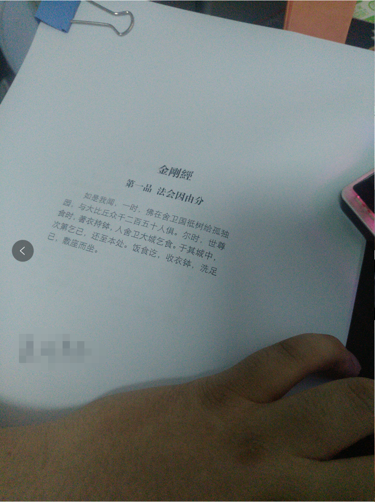
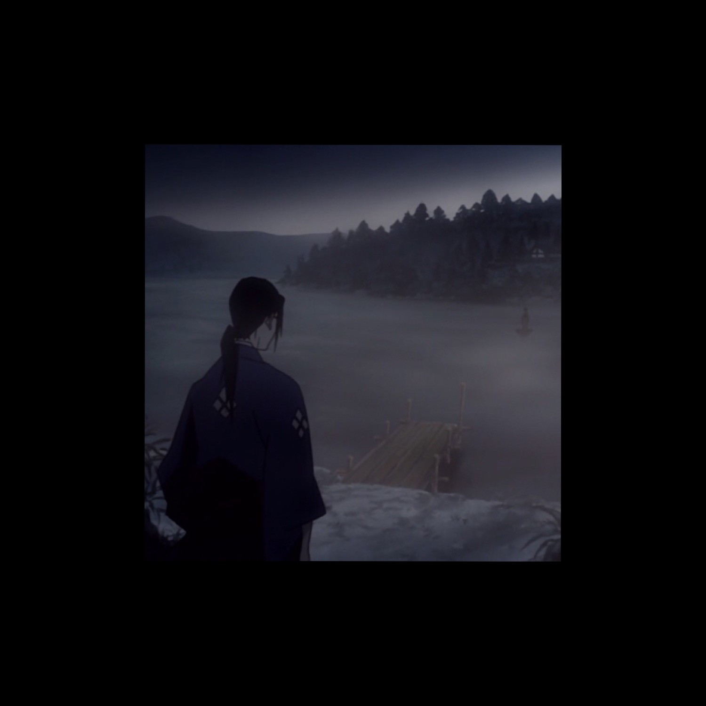

## 记一次徘徊

时间已19年年中,人也快到而立之年,双木成林,三人聚众,我却只能孤影对残月.  

  

#### 关于一些无聊的回忆
又一段时间过去,深感无力,在这段时间,我无论是工作生活学习均无任何起色.其实也不是这段时间的问题,从九江到现在一直都是浑浑噩噩,不知所谓不知何为,我骗自己说一句缓解过来了,可以和一个正常人一样生活和接触他人了,可以和一个正常人一样工作和学习了,然而.  

今天在实验室观看了很久之前就已经看腻的一部电影,周杰伦陈冠希的<<头文字D>>,情节甚至台词我都记得相当清楚,我也不知道为什么会看,随时可以从U盘找出来的电影只有两部,还有一个是<<V字仇杀队>>,后一部我已经非常就没敢观看了,我是个比较奇怪的人,我并不算是很喜欢看电影的那种,也不是专业的影评人或者是大神,但是我喜欢的电影我都会反反复复的观看,虽然自己也知道这并不是一个很好的习惯,会让我接触不到新的东西,固守在三寸灵台之内,改不了也变得不喜欢也不习惯接触新事物.  

依稀记得当年并不是这个样子,依稀记得参加大一新生演讲比赛的样子,依稀记得大二作为学院二辩手准备辩论的样子,依稀记得为结识更多朋友同志去参加各种比赛的样子. 但是现在我只敢在这个实验室三点一线的出没,甚至连去主公司都不情愿,不情愿接触别人,不想和别人交流,只想扯扯犊子,说一些无聊的笑话.  

#### 关于电影

看到藤原拓海,或者说周杰伦扮演下的这个藤原拓海,仿佛他也是被困在他的世界中,这个世界和我一样是别人勘不破的,也是进不去的,说不定有时间自己都进不去的.在这部<<头文字D>>中,我只看了几个场景,这几个场景对我的体悟比较深:第一个就是阿木已经告知拓海关于夏树的真相,冲突过后,阿木主动打电话给拓海道歉. 首先这是阿木亲眼看到的,自己的七岁到现在的朋友的女朋友和别人出入炮区,且举止亲密,这个人只要正常,都会想到什么,阿木也将之直言于拓海,然而两者之间的冲突确实避免不了的,事后阿木主动道歉. 话说阿木做的不对么, 话说拓海做的不对么,貌似都没有.这里突然想起自己,我似乎没有这个一个诸如阿木的朋友,所以我在鼓里很久.  

第二个场景就是最后拓海看见真相,彻底自闭的<<一路向北>>,貌似是哭了相当长一段时间,先给阿木道了歉,再申请加入车队. 对于他来说,说不定是初恋,之前看过一个什么心理学报告,阐述的是男女对于初恋的什么什么.也不能确定是想忘记她还是想彻底记住她.  
  

#### 关于现况

在我认为,只要没走出过去的阴影,没有对现状进行向上的改变,就还一直处于失败之中,处于失败之中已经很久很久了.  
人的两面性在我身上体现的特别明显,我并不想让任何人知道我在现实中阴暗角落中的身份,不仅不光彩,还会慢慢想起一些不堪的往事,给我带来更多的痛苦.  

从身体的情况还说,痛风真是一个折磨的病痛,我在贴吧的痛风吧中看到,诸多人士受到剧烈疼痛的折磨,我也在这一群体之中,图片可以在贴吧中查找,要问我有多疼的话,很难描述;  

在我之前的人生中,大一时期在某医院检查出耳后动脉旁查出有个瘤子在血管附近,且说没办法判断良性恶性,必须要开刀,但是此处在大脑旁边,我对吸入麻醉过敏,没办法全麻,遂医生给我临时局部麻醉,说我感觉疼了就临时加打麻药,入手术室的时候我还笑着想"相国我又想起一辈古人来了",自己为自己做术前准备,自己签字,自己缴费,没有通知家人 老师 同学,这也是我后面几乎没上过课的原因之一,我一个人被推进手术室的时候才觉得一个人,是不是有点孤单.所幸得知良性,但是在术中,我可以清晰听到并感知到手术刀划开我的皮肤的部分知觉和声音,还有术中麻药不足导致的剧烈疼痛...  

我没有经受过生产,听说十二级痛是生产时的阵痛,目前最痛的一次就是这次手术中的疼痛,痛风最严重一次发作时,我也是一个人,更甚于此,是时万念俱灰,无意再留于世,是时也想不到我最爱的家人 爱人,从瓶子倒出不明的安眠药,还有很多乱七八糟的药,比如秋水仙碱,芬必得,英太青,褪黑素,氨加黄敏等等,一口气全都吞了,这次服药造成了秋水仙碱中毒和近多年来睡的最久的一次,还包括了大小便失禁和一堆丑事,包括了出现幻觉幻听,很长时间的精神无法集中,眼睛没办法快速对焦,会莫名摔倒等.实在不表.就这次的疼痛而言是相比手术中的更加剧烈的.  

身体上疲劳和疼痛,都还算好,失眠是个很严重的问题,这个导致我在工作中生活中学习中都没办法太过专注,不知道记忆力下降和这个是不是有一点关系,但是现在医生已经不肯给我开安眠药了,只能买安神补脑液和褪黑素来将就,但是发现基本没效果,加上有点贵,就不再服用了.  

#### 关于学术界业界和学习

最近有人问我为什么不辞职,为什么还要在这里呆下去,我着实不喜欢在学校,不喜欢呆着实验室,我更不喜欢我在玩命干活,人家在玩命的娱乐,也不喜欢付出和回报完全不成正比.
曾经受到商汤的offer,但是最后左思右想还是没有去,和我一起拿到offer除我外均是博士,我就算是进去我估计也是一个打杂的活计,不可能说我是项目主管或者是负责人之类的.我不喜欢无理由听由别人的决定,特别是我擅长的领域的.  
也许还有不愿意主动去改变,随遇而行却不得安.  

今天在实验室的旁边报告厅进行了一场CCF大佬的"盛宴",我实在无力吐槽了.尽管我远远及不上这些大佬么,无论是学历上还是能力上,我还是个失败者,大佬们简历上各种论文,我呢,一个ICML都拒绝我两年6篇论文了.我实在是没资格评论人家.之前<<基于人工的人工智能>>已经说得很狠了.我只能说得一点是 时间一天半(包括开幕式 茶歇等),超过11个课题...  

#### 关于徘徊

不知道是不是人类的习惯,隔一段时间就会迷茫一次,我是已经迷茫好几年了,到底该如何是好,是做亦或不做,是继续还是放弃,是当如何  
借用一句话,混沌武士 仁收回刀背向师弟的一句话,"我现在跟死了没有区别"
  
